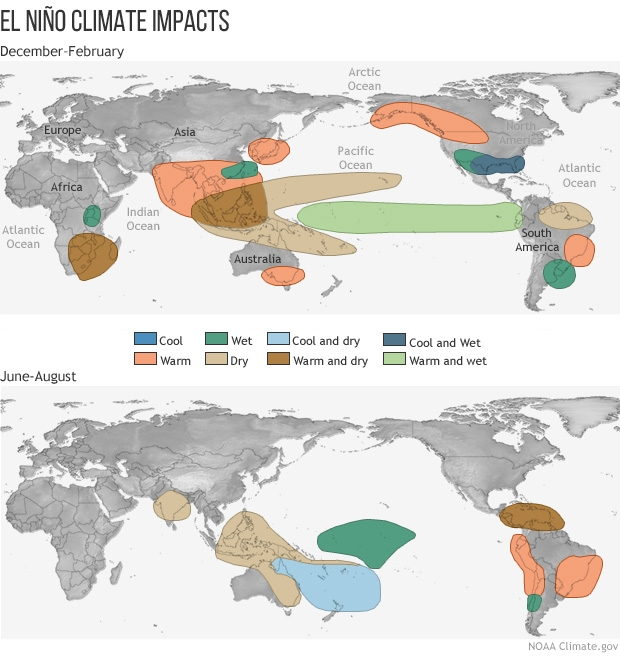
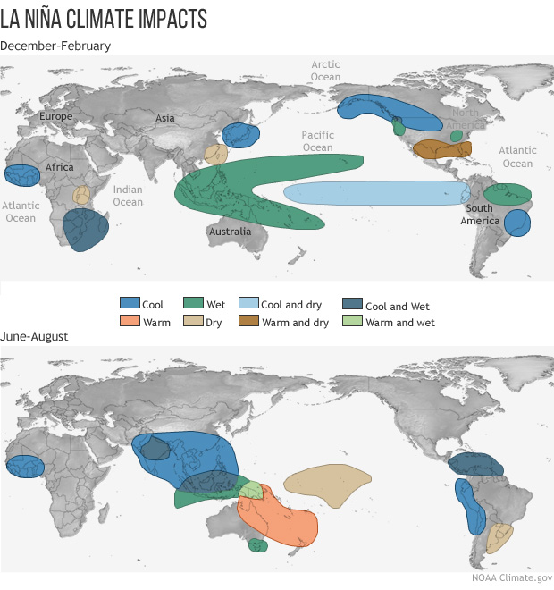
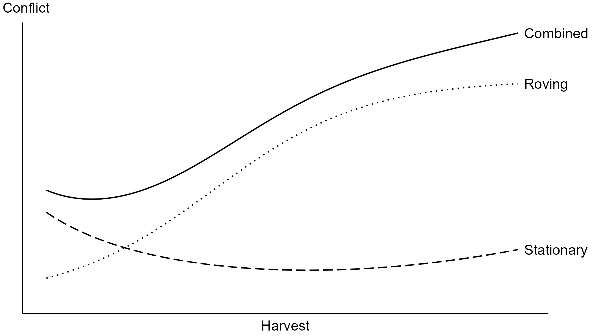
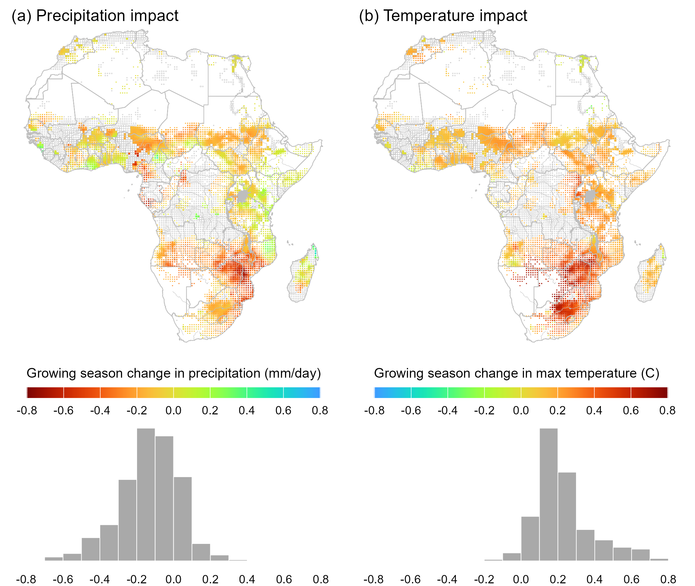
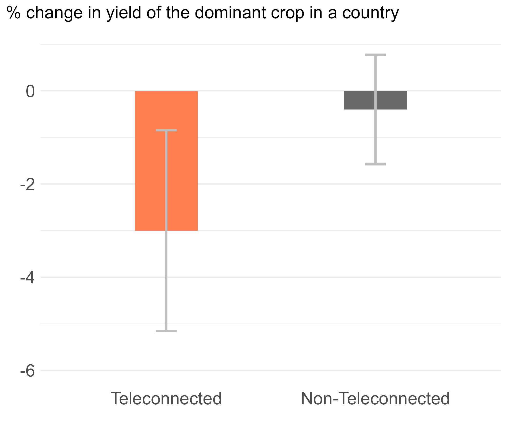
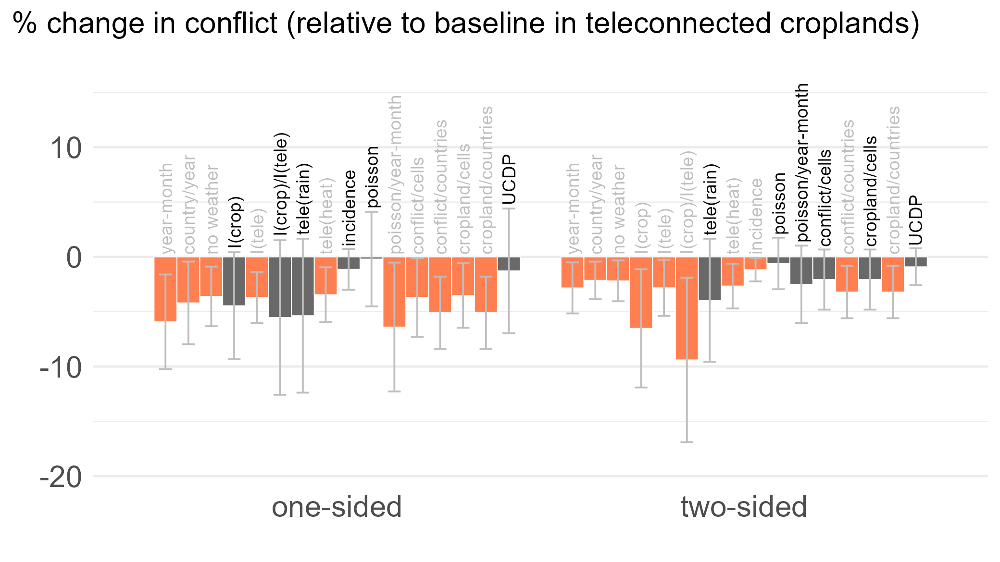
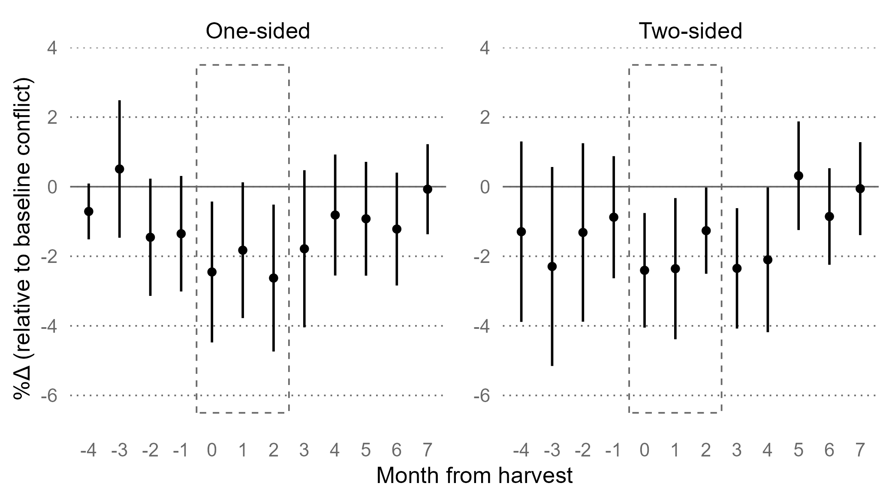

```{r setup, include=FALSE}
knitr::opts_chunk$set(echo = FALSE)
library(extrafont)
loadfonts(device="win",quiet=T)
```


# Climate affects us in many ways

.right-85[

The effects can be direct and obvious such as, e.g., reduction in crop yields due to droughts, increase in morbidity and mortality due to heatwaves, or loss of property (value) due to flooding.

The effects can also be indirect, possibly mediated by some of the above effects, and thus somewhat more subtle.

The effect is felt the most among the communities that already operate under socio-economic duress.

]

---


# Weather extremes have been linked with conflict

.right-85[

Extreme deviations in rainfall have been found to be positively correlated with political conflict ([Hendrix & Salehyan 2012](https://doi.org/10.1177/0022343311426165)) 

Improved weather during the crop growing season reduces conflict incidence in subsequent years ([Harari & La Ferrara 2018](https://doi.org/10.1162/rest_a_00730))

Inter-group conflict can be an outcome of the climate-induced resource scarcity ([McGuirk & Nunn 2024](https://doi.org/10.1093/restud/rdae027))

But a relative food abundance in regions with chronic food scarcity can also instigate conflict ([Koren 2018](https://doi.org/10.1093/ajae/aax106))

]

---


# This study focuses on El Niño Southern Oscillation

.right-85[

Using El Niño Southern Oscillation (ENSO) instead of weather to examine the effect of climate on conflict has several advantages:

- ENSO is a medium-frequency climate variable with sufficiently well-understood dynamics that allows for its occurrence to be predicted at least several months in advance.
- ENSO is a better proxy for climate because of its potential to simultaneously alter a whole range of weather variables across large swathes of land.

]

---

# Global weather impacts of ENSO


.left-45[

]

.right-45[


]

---


# Do El Niño events cause conflict?

.right-85[

If the key channel in this relationship is agriculture, we would expect to observe the effect *in locations with crop agriculture*, where *local weather is most responsive to ENSO events*. 

In these locations, we would expect the effect to manifest itself *during the harvest or early postharvest season* when the potential benefits of political violence are the highest, and when intra-year and inter-group disparities in income are most apparent.

]

---


# Yes. El Niño events reduce conflict!

.right-85[

A moderate El Niño reduces violence against civilians by 3.6% and conflict between actors by 2.2% (relative to the baseline conflict, evaluated at average cropland size and average crop growing season intensity of ENSO teleconnections).

The effect is scalable: A strong El Niño (e.g., 1997 or 2015) in highly exposed croplands (e.g., Southern Africa and parts of Sahel) can translate close to a 15% reduction in violence against civilians, and a 10% reduction in conflict between actors.

The effect is symmetric: La Niña events increase conflict.

]

---


# Historical evidence

.right-85[

Over the course of our history, wars and rebellions often followed crop failure that resulted in food shortages (e.g., Rudé, 1964). 

El Niño events have historically contributed to famine and conflict.

]

---


# Historical evidence

.right-85[

As a result of (or in relation to) the 1876-78 El Niño events:

- In India, **thievery became commonplace, with perpetrators targeting rural landowners, seizing their grain stores, and destroying their properties;** calls for armed rebellion against British rule (Davis, 2002; Fagan, 2009).
- In Indonesia, **to make the most impact, Dutch invaders strategically timed their scorched-earth campaign to coincide with the onset of the rice harvest season** (Kreike, 2022).

]

---


# Historical evidence

.right-85[

In Ethiopia, 'The Cruel Days' of 1988-92 were likely triggered by El Niño events that brought about droughts. 

- The lack of food provision turned provincial governors and their warriors into foraging bandits. **Trade routes in Ethiopia and neighboring countries fell victim to raids aimed at appropriating imported grain** (Davis, 2002).

]

---


# Harvest and conflict: empirical evidence

.right-85[

In times of chronic food scarcity, its sporadic abundances often triggered grievances and motivated the rapacious targeting of one group by another (e.g., Davis, 2002; Hassen, 2002). 

- Invasions were strategically staged around harvest seasons to ensure access to food and impose hardship by destroying their years’ worth of work (Hanson, 1998; Keeley, 2016).

- Harvest-time violence aimed at gaining access to local food supplies&mdash;'living off the land'&mdash;has been a feature of warfare (Erdkamp, 1998; Koren and Bagozzi, 2017).

]

---


# Harvest and conflict: conceptual illustration

.right-85[



]

---


# Conflict trends and geographic coverage

.left-45[

The whole continent is, largely, conflict-prone, although some countries (e.g., Nigeria, Somalia) much more than others. 

Conflict trends have accelerated during the past decade, some of which is, probably, the art-effect of better coverage and reporting. 

]

.right-50[


]

---


# Beyond the graphs and numbers...

.right-85[

-	In Morocco, “On 16 and 17 June 2019, clashes were reported between pastoralists and residents in Labkhati in Safi over the use of agricultural land by pastoralists to feed their herds...”

- In Uganda, “On 5 June 2020, members of the Pajong Acholi clan attacked the Palwo clan village of Latuturu ..., torching around 43 huts and destroying food stores and crops. The attack is linked to a land dispute between the clans ...”

-	In Ethiopia, “On 31 January 2022, Amhara militias attacked civilians and killed 8 farmers in Ajilo Dalle kebele ... in Dano ....”

]

---


# Crop production and harvest

.left-45[

Across croplands, maize is the most dominant crop, followed by sorghum and others. 

Harvest happens (almost) all year round, depending on location. 

]

.right-50[


]

---


# Oceaning Niño Index and ENSO events

.right-85[


]

---


# ENSO teleconnections

.left-45[

A positive deviation in the December Oceanic Niño Index reduces precipitation and increases heat during the crop growing season across Africa.

]

.right-50[



]

---


# Identifying assumptions

.right-85[

I rely on temporal variation in ENSO and on spatial variations in the intensity of agricultural production, the timing of production and harvest, and the exposure of local weather to ENSO shocks during the crop-growing season. 

I assume that conflict in locations exposed to ENSO shocks and in locations not exposed to ENSO shocks (because of no crop agriculture or no teleconnections) would have evolved similarly absent an ENSO event. 

]

---


# El Niño events lower crop yields in Africa

.left-45[

Causal chain involves ENSO impacting local weather (Fan et al. 2017; Anderson et al. 2023), and local weather impacting the agricultural output (Ray et al. 2015; Heino et al. 2023).

]

.right-50[



]


---


# Econometric specification

$$
\begin{aligned}
CONFLICT_{itm}  &= \beta_1 AREA_i\times TC_i^{gs}\times ENSO_{it}^{gs} \\
                &+ \beta_2 AREA_i\times TC_i^{gs}\times ENSO_{it}^{gs}\times PH_{itm} \\ 
                &+ \theta'X_{itm}+\mu_i+\lambda_{ctm}+\varepsilon_{itm}
\end{aligned}
$$


---

# El Niño decreases postharvest conflict in croplands

.right-85[


]

---

# The main result is (largely) robust

.right-85[



]

---


# The effect is evident in adversely affected croplands

.right-85[


]

---

# The effect is evident in 'agrarian' conflict

.right-85[


]

---


# The effect is evident in the early pstharvest season

.right-85[



]

---


# Contribution to climate and conflict

.right-85[

Within this strand, this work contributes to the relatively thin literature on the relationship between ENSO shocks and conflict.

The existing knowledge, based on larger-scale incidents and longer-term conflict dynamics, largely suggests that yield-reducing El Niño events increase conflict ([Hsiang et al. 2011](https://www.nature.com/articles/nature10311)).

This finding does not necessarily contradict the existing knowledge; rather, it points to spatiotemporal displacement of conflict, specifically in relation to to the harvest season. 
]

---


# Contribution to (food/resource) abundance and conflict

.right-85[

This contribution is somewhat speculative, as it does not examine the effect of a change in food and agricultural resources on conflict; instead, it examines how changes in climatic conditions, most likely through changes in availability of food and agricultural resources, affect harvest-time conflict. 

This contribution is, nonetheless, valuable, including from a policy-making standpoint, as it not only confirms the positive relationship between food abundance and conflict but also pinpoints the narrow window during the calendar year when this relationship manifests in the croplands of Africa.

]

---


# Contribution to the seasonality of conflict

.right-85[

ENSO-related changes in conflict that materialize through the agricultural channel predominantly manifest during the early postharvest season. 

This seasonal relationship, inherently a temporal concept, also contains spatial aspects: Crop calendars vary across Africa, and so does the intra-year timing of the ENSO effect on conflict.

]

---


# Climate change implications

.right-85[

ENSO events can be predicted several months ahead&mdash;room for spatiotemporal adjustments to peacemaking activities in response to short-term climate shocks.

Climate change is expected to intensify ENSO cycles&mdash;fluctuating agricultural production/incomes will make it difficult for actors to form long term social contracts.

Climate change is expected to displace crop agriculture&mdash;harvest-related conflict will likely follow from areas with depleted crop agriculture to areas with intensified crop agriculture.

]

