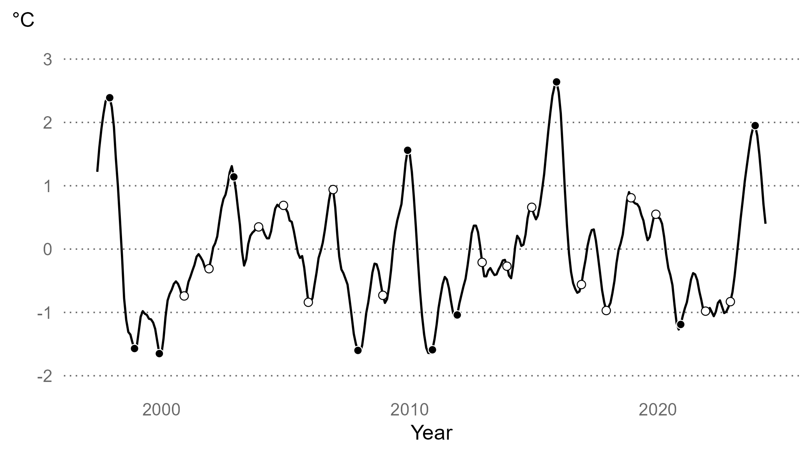

```{r setup, include=FALSE}
knitr::opts_chunk$set(echo = FALSE)
library(extrafont)
loadfonts(device="win",quiet=T)
```


# We care about climate change because it affects us

.right-85[

The effects can be direct and obvious such as, e.g., reduction in crop yields due to droughts, increase in morbidity and mortality due to heatwaves, or loss of property (value) due to flooding.

The effects can also be indirect, possibly mediated by some of the above effects, and thus somewhat more subtle.

]

---


# Deviations in weather have been linked with conflict

.right-85[

Extreme deviations in rainfall have been found to be positively correlated with political conflict ([Hendrix & Salehyan 2012](https://doi.org/10.1177/0022343311426165)) 

Improved weather during the crop growing season reduces conflict incidence in subsequent years ([Harari & La Ferrara 2018](https://doi.org/10.1162/rest_a_00730))

Inter-group conflict can be an outcome of the climate-induced resource scarcity ([McGuirk & Nunn 2024](https://doi.org/10.1093/restud/rdae027))

But a relative food abundance in regions with chronic food scarcity can also instigate conflict ([Koren 2018](https://doi.org/10.1093/ajae/aax106))

]

---


# Do El Niño events cause conflict?

.right-85[

If the key channel in this relationship is agriculture, we would expect to observe the effect *in locations with crop agriculture*, where *local weather is most responsive to ENSO events*. 

In these locations, we would expect the effect to manifest itself *during the harvest or early postharvest season* when the potential benefits of political violence are the highest, and when intra-year and inter-group disparities in income are most apparent.

]

---


# Yes. El Niño events reduce conflict!

.right-85[

A moderate El Niño reduces violence against civilians by 3.6% and conflict between actors by 2.2% (relative to the baseline conflict, evaluated at average cropland size and average crop growing season intensity of ENSO teleconnections).

The effect is scalable: A strong El Niño (e.g., 1997 or 2015) in highly exposed croplands (e.g., Southern Africa and parts of Sahel) can translate close to a 15% reduction in violence against civilians, and a 10% reduction in conflict between actors.

The effect is symmetric: La Niña events increase conflict.

]

---


# Oceaning Niño Index and ENSO events

.right-85[



]

---


# ENSO teleconnections

.left-45[

A positive deviation in the December Oceanic Niño Index reduces precipitation and increases heat during the crop growing season across Africa.

]

.right-50[


]

---


# Crop production and harvest

.left-45[

Across croplands, maize is the most dominant crop, followed by sorghum and others. 

Harvest happens (almost) all year round, depending on location. 

]

.right-50[


]

---


# Conflict trends and geographic coverage

.left-45[

The whole continent is, largely, conflict-prone, although some countries (e.g., Nigeria, Somalia) much more than others. 

Conflict trends have accelerated during the past decade, some of which is, probably, the art-effect of better coverage and reporting. 

]

.right-50[


]

---


# Econometric specification

$$
\begin{aligned}
CONFLICT_{itm}  &= \beta_1 AREA_i\times TC_i^{gs}\times ENSO_{it}^{gs} \\
                &+ \beta_2 AREA_i\times TC_i^{gs}\times ENSO_{it}^{gs}\times PH_{itm} \\ 
                &+ \theta'X_{itm}+\mu_i+\lambda_{ctm}+\varepsilon_{itm}
\end{aligned}
$$


---

# El Niño decreases postharvest conflict in croplands

.right-85[


]

---

# Especially in adversely affected croplands

.right-85[


]

---

# Especially the 'agrarian' conflict

.right-85[


]

---


# Climate change implications


.right-85[

ENSO events can be predicted several months ahead&mdash;room for spatiotemporal adjustments to the scope and extent of peacemaking activities in response to short-term climate shocks.

Climate change is expected to intensify ENSO cycles&mdash;more frequent/drastic changes in agricultural production/incomes will make it difficult for actors to engage in long term social contract.

Climate change is expected to displace crop agriculture&mdash;harvest-related conflict will likely follow from areas with depleted crop agriculture to areas with intensified crop agriculture.

]


