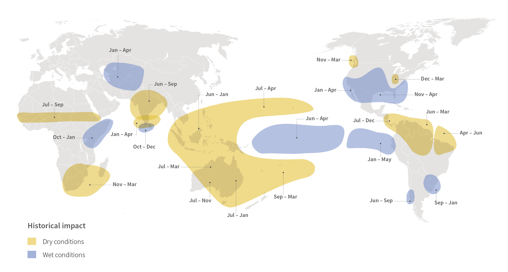
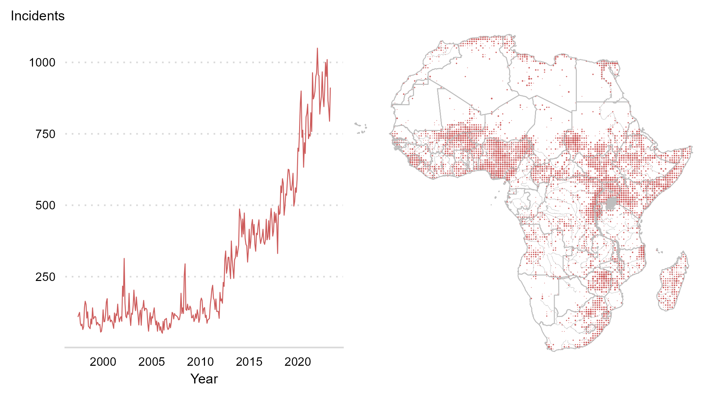
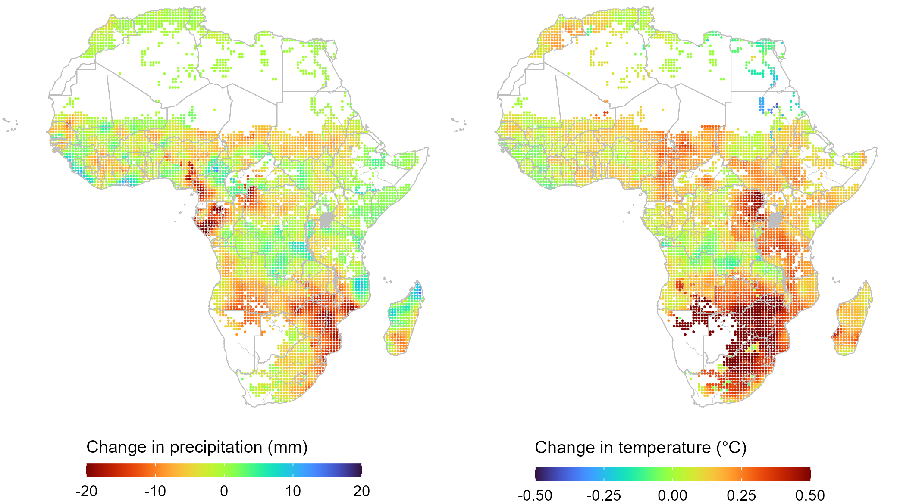
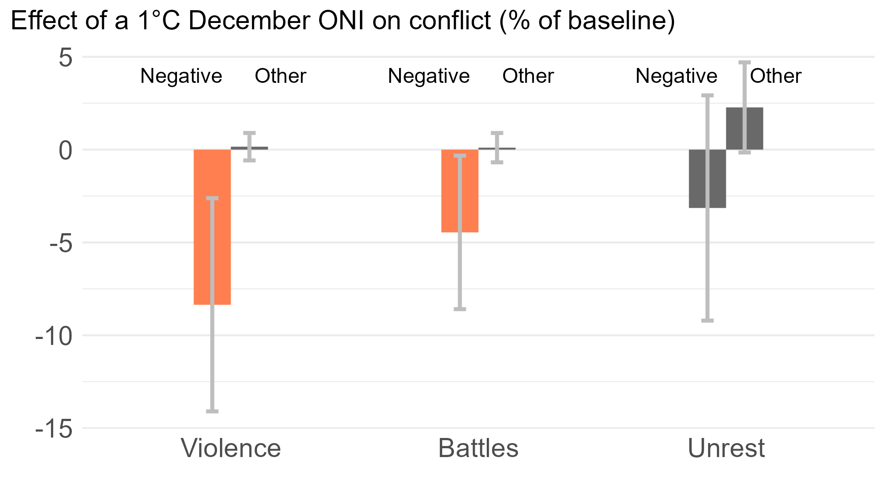

```{r setup, include=FALSE}
knitr::opts_chunk$set(echo = FALSE)
library(extrafont)
loadfonts(device="win",quiet=T)
```


# El Niño (Southern Oscillation) alters global weather

.right-85[

]

---


# Precipitation forecast for Dec 2023 - Feb 2024

.left-35[

]

.right-35[

]

---


# Do El Niño events contribute to social conflict?

Deviations in weather have been linked with changes in political violence and social unrest ([Hendrix & Salehyan 2012](https://doi.org/10.1177/0022343311426165
); [Couttenier & Soubeyran 2014](https://doi.org/10.1111/ecoj.12042)).

If the key channel in this relationship is agriculture, we would expect to observe the effect **in locations with crop agriculture**, where **local weather is most responsive to ENSO events**. 

In these locations, we would expect the effect to manifest itself **during the harvest or early postharvest season** when the potential benefits of political violence are the highest, and when intra-year and inter-group disparities in income are most apparent.

---


# Yes... El Niño events reduce conflict!

But **only** political violence targeted at civilians, and **only** in locations with crop agriculture and during the early postharvest season. 

**A 1&deg;C increase in the December Oceanic Niño Index (ONI)&mdash;typically indicative of a moderate El Niño event&mdash;is associated with at least three percent reduction in political violence during the three-months period after harvest (evaluated at average cropland size and average crop growing season intensity of ENSO teleconnections).**

---


# Historical evidence: The late 19th cebtury El Niño events


As a result of (or in relation to) the 1876-78 El Niño events:

- In India, thievery became commonplace, with perpetrators targeting rural landowners, seizing their grain stores, and destroying their properties; calls for armed rebellion against British rule (Davis, 2002; Fagan, 2009).
- In Indonesia, to make the most impact, Dutch invaders strategically timed their scorched-earth campaign to coincide with the onset of the rice harvest season (Kreike, 2022).

---


# Historical evidence: The late 19th cebtury El Niño events

In Ethiopia, 'The Cruel Days' of 1888-92 were likely triggered by El Niño events that brought about droughts. 

- The lack of food provision turned provincial governors and their warriors into foraging bandits. Trade routes in Ethiopia and neighboring countries fell victim to raids aimed at appropriating imported grain (Davis, 2002).

---


# Relative food abundance during its general scarcity

(El Niño related) weather adversities lead to food scarcity. But in that regime, sporadic abundances of food has often served as a trigger for grievances or a motive for the rapacious attacks (e.g., Davis, 2002; [Hassen, 2002](https://www.jstor.org/stable/41931279)). 

Military invasions often were strategically staged around harvest seasons to ensure access to food and impose hardship on the local population by destroying their years’ worth of work (Hanson, 1998; Keeley, 2016).

Harvest-time violence against civilians with intent to gain access to local food supplies&mdash;a tactic known as 'living off the land'&mdash;has been a feature of warfare throughout history (Erdkamp, 1998; [Koren and Bagozzi, 2017](https://doi.org/10.1177/002234331668454)).

---


# Why (and how) might harvest alter conflict?

Location and timing are typically known well in advance, but crop yields are determined by weather conditions shortly before the harvest. 

Crop growing season weather and realized yields can influence perpetrators’ decisions as they assess whether the potential spoils to be appropriated are worth their effort ([Koren and Bagozzi, 2017](https://doi.org/10.1177/002234331668454); [McGuirk and Burke 2020](https://doi.org/10.1086/709993)).

Changes in agricultural yields can induce social unrest, as farmers and non-farmers assess their well-being relative to the expectations or to the well-being of others ([Mitra and Ray, 2014](https://doi.org/10.1086/676316); [Hendrix and Haggard, 2015](https://doi.org/10.1177/00223433145615)).

---


# Conflict trends and spatial coverage

.right-85[



]

---

# Crop production and harvest seasons

.right-85[


]

---

# ENSO teleconnections

.right-85[


]

---

# Local weather responses to El Niño events

.right-85[



]

---

# Research design

I exploit variations in the ENSO–conflict relationship between cells with different numbers of months during the crop growing season, in which changes in local weather are linked to changes in sea surface temperatures during the peak ENSO season. 

The ENSO–conflict relationship in locations with small or no cropland is assumed to serve as a good counterfactual for the ENSO–conflict relationship that would have been observed in locations with sizable cropland in absence of an ENSO event. 

---


# Effect of El Niño on conflict

$$y_{it}=\alpha\tau_i s_t+\theta ' x_{it}+\mu_i+\lambda_t+\varepsilon_{it}$$

.right-50[

]

---

# A crop year adjusted ONI

.right-85[


]

---


# Effect of El Niño on conflict in croplands

$$y_{it}=\alpha\tau_i s_t+\beta a_i\tau_i^{gs} s_t^{gs}+\theta ' x_{it}+\mu_i+\lambda_t+\varepsilon_{it}$$

.right-50[

]

---


# Effect of El Niño on postharvest conflict in croplands

$$y_{it}=\alpha\tau_i s_t+\beta a_i\tau_i^{gs} s_t^{gs}+\gamma a_i\tau_i^{gs} s_t^{gs}d_{it}+\delta a_i d_{it}+\theta ' x_{it}+\mu_i+\lambda_t+\varepsilon_{it}$$

.right-50[

]

---

# Robustness checks

The estimated effect is not sensitive to

- different sets of fixed effects
- different sizes of postharvest windows
- omitting conflict 'hotspots'
- using incidence as the dependent variable

---

# 'Bad' El Niño

.left-45[

]

.right-50[

]

---

# 'Agrarian' conflict

.left-45[
**Keywords**: farm, farmer, peasant, producer, agriculture, agricultural, livestock, animal, cattle, sheep, goat, crop, cereal, grain, maize, millet, rice, sorghum, wheat, produce, food, harvest.
]

.right-50[

]

---


# 'Strongly' vs 'Weakly' teleconnected countries

.right-85[


]

---

# 'Strongly' vs 'Weakly' teleconnected countries

.right-50[

]

---


# Contribution to climate-conflict nexus

I clarify that **the effect of El Niño on conflict is not unequivocally positive**, as previously thought (e.g., [Hsiang et al., 2011](https://www.nature.com/articles/nature10311))

- I focus on small-scale incidents of different conflict types and on short-term climate shocks.
- [Hsiang et al. (2011)](https://www.nature.com/articles/nature10311) focused on larger-scale incidents and longer-term conflict dynamics.

El Niño–induced weather adversity during a crop-growing season **decreases political violence during the short period after harvest**, plausibly because of a smaller prize in the form of food or cash available for perpetrators.

---


# Contribution to conflict seasonality

ENSO-related changes in conflict materialize through the agricultural channel. 

While not surprising, this finding unveils an important nuance related to the seasonal nature of agricultural production: **the effect aligns with crop-year calendars and manifests during the early postharvest season**. 

This finding accords with recent literature on the positive relationship between agricultural output and conflict (e.g., [McGuirk and Burke 2020](https://doi.org/10.1086/709993); [Crost and Felter 2020](https://doi.org/10.1093/jeea/jvz025); [Koren and Schon 2023](https://link.springer.com/article/10.1007/s10113-023-02090-7)) and contributes to the emerging literature on the seasonal patterns of conflict (Guardado and Pennings 2023; [Ubilava et al. 2023](https://doi.org/10.1111/ajae.12364)).

---

# An alternatve interpretation

That El Niño-induced weather adversities during the crop growing season result in less political violence is not exactly a silver lining. 

One interpretation of this findings may be that postharvest conflict serves as a litmus test of socioeconomic vulnerability in conflict-prone countries. 

Lack of political violence may be seen as a sign of food scarcity and increased hardship among rural households.

---


# Policy implications

These findings also have clear policy implications in establishing an **early-warning system for political violence in ENSO-affected regions** of Africa. 

**Because we can predict ENSO events** at least several months in advance, the estimated linkages between ENSO shocks and conflict may help guide local authorities and international organizations in making spatiotemporal adjustments to the scope and extent of their peacemaking activities.

---

# References (not linked)

#### Davis M. (2002). Late Victorian Holocausts: El Niño Famines and the Making of the Third World. Verso.

#### Erdkamp, P. (1998). Hunger and the Sword: Warfare and Food Supply in Roman Republican Wars (264–30 BC). Brill.

#### Fagan, B. (2009). Floods, Famines, and Emperors: El Niño and the Fate of Civilizations. Basic Books.

#### Guardado, J., and Pennings, S. (2023). The Seasonality of Conflict. Conflict Management and Peace Science (accepted).

#### Hanson, V. D. (1998). Warfare and Agriculture in Classical Greece. University of California Press.

#### Keeley, L. H. (2016). Food for War, War for Food, and War on Food. In: van Derwarker, A., Wilson, G. (eds) The Archaeology of Food and Warfare. Springer.

#### Kreike, E. (2022). A Perfect Tsunami? El Niño, War and Resilience on Aceh, Sumatra. In Perspectives on Public Policy in Societal-Environmental Crises: What the Future Needs from History (pp. 123–44). Springer.

#### Rudé, G. F. (1964). The Crowd in History: A Study of Popular Disturbances in France and England, 1730–1848. Wiley.


