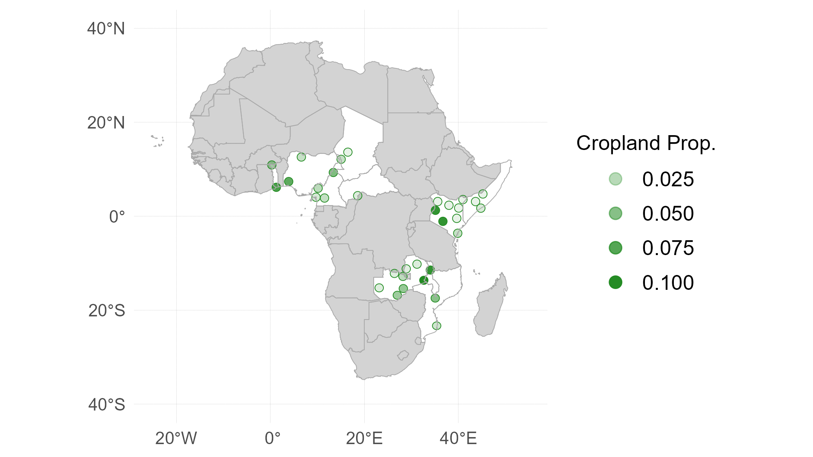
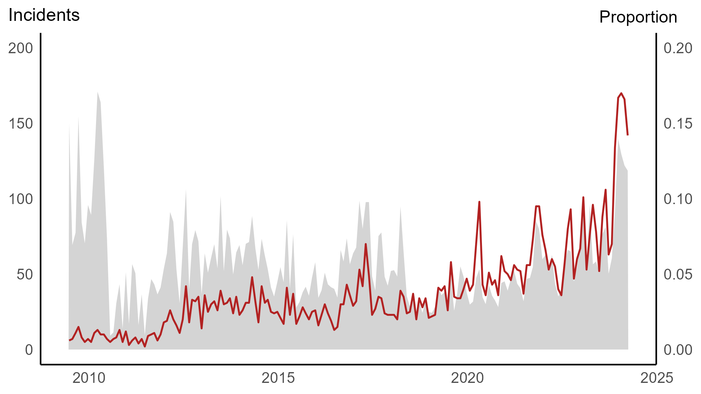
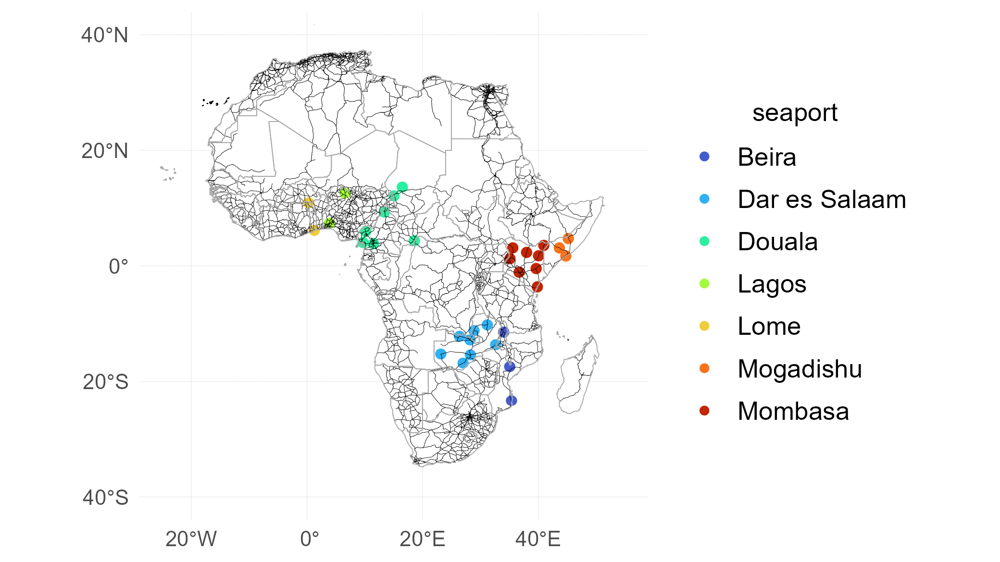
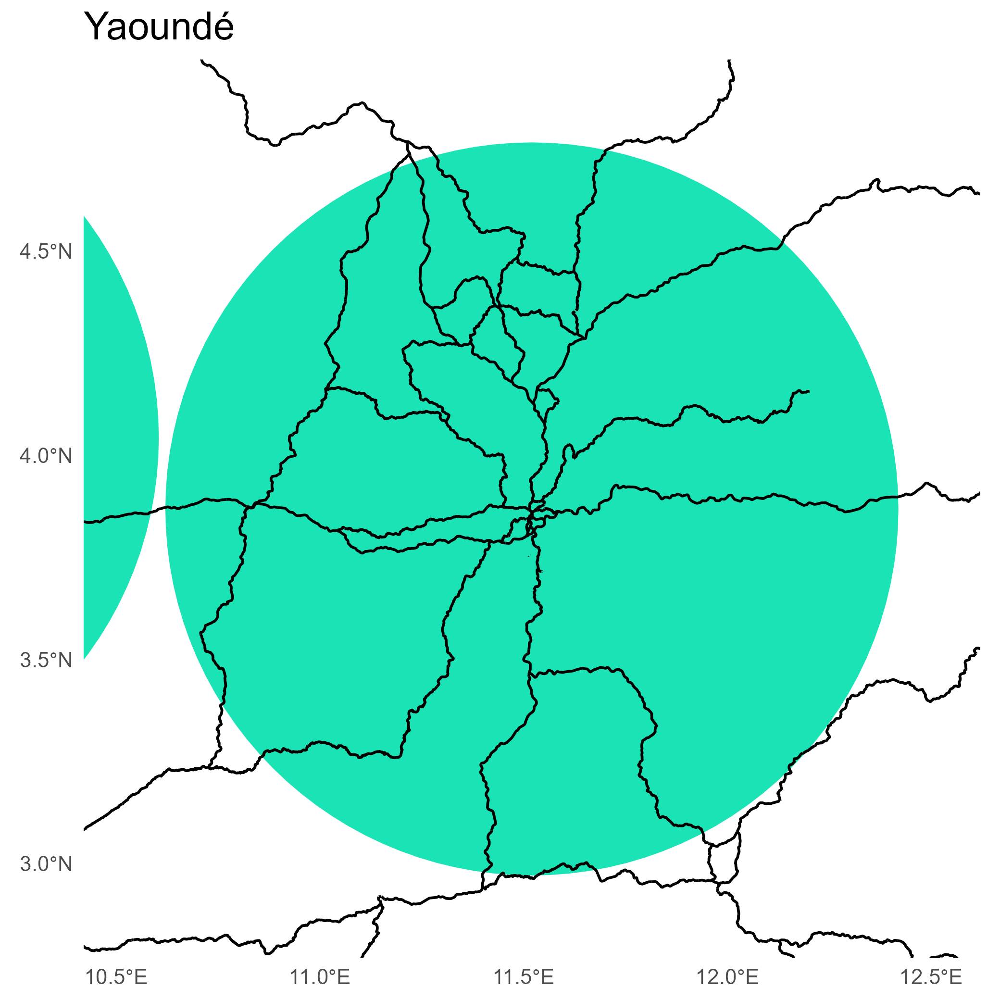
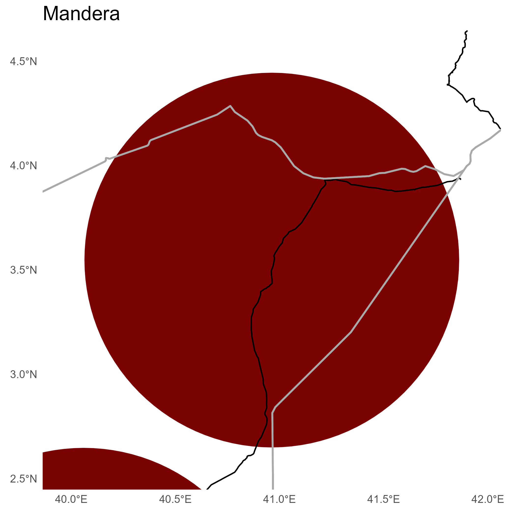
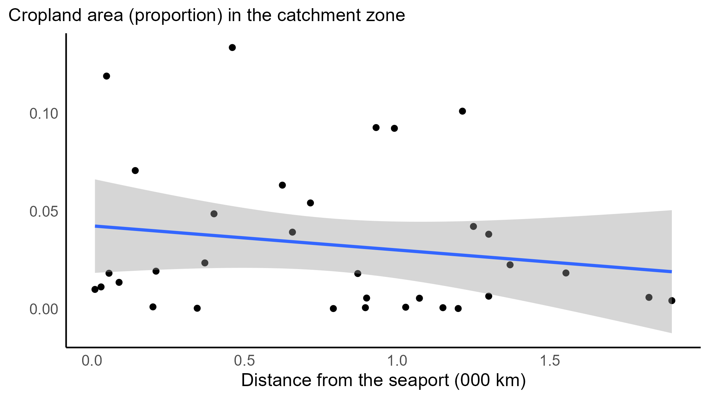

```{r setup, include=FALSE}
knitr::opts_chunk$set(echo = FALSE)
library(extrafont)
loadfonts(device="win",quiet=T)
```


# Commodity prices and conflict

.right-85[

Commodity price shocks have welfare implications for both net producers and consumers. In economies with dire social conditions and fragile political systems, these shocks may contribute to conflict.

Empirical evidence on the relationship between commodity prices and conflict, particularly in the agricultural sector, is unequivocal ([Blair et al. 2021](https://www.cambridge.org/core/journals/american-political-science-review/article/abs/do-commodity-price-shocks-cause-armed-conflict-a-metaanalysis-of-natural-experiments/469E8F1CBA02E4E5D525E3355DC401D9)). Studies have found both negative relationship ([Dube and Vargas, 2013](https://doi.org/10.1093/restud/rdt009); [Berman and Couttenier, 2015](https://doi.org/10.1162/REST_a_00521);[Fjelde, 2015](https://doi.org/10.1016/j.worlddev.2014.10.032)) and positive relationship ([Crost and Felter, 2020](https://doi.org/10.1093/jeea/jvz025); [McGuirk and Burke](https://doi.org/10.1086/709993); [Ubilava et al., 2023](https://doi.org/10.1111/ajae.12364)) between commodity prices and conflict.

]

---


# Evidence from the 21st century

.right-85[

Co-movement between food prices and social unrest occurred during each major 21st-century agricultural commodity price shocks. 

The first of these shocks, when real prices of staple crops such as wheat and maize nearly doubled between 2004 and 2008 ([Headey and Fan, 2008](https://doi.org/10.1111/j.1574-0862.2008.00345.x)), has been linked to increased social unrest in developing countries ([Berazneva and Lee, 2013](https://doi.org/10.1016/j.foodpol.2012.12.007); [Bellemare, 2015](https://doi.org/10.1093/ajae/aau038)). 

The second of these shocks, which began in 2010 and saw real food prices rise to levels comparable to the previous episode ([Ivanic et al., 2012](https://doi.org/10.1016/j.worlddev.2012.03.024)), likely contributed to the "Arab Spring," which led to the collapse of governments in the MENA region ([Sternberg, 2012](https://doi.org/10.1016/j.apgeog.2012.02.004); [Soffiantini, 2020](https://doi.org/10.1016/j.gfs.2020.100400)).

]

---


# We focus on local price shocks

.right-85[

Most existing studies use international prices as exogenous proxies for local economic shocks ([Berman and Couttenier, 2015](https://doi.org/10.1162/REST_a_00521); [McGuirk and Burke](https://doi.org/10.1086/709993); [Ubilava et al., 2023](https://doi.org/10.1111/ajae.12364)). 

We examine the implied causal mechanism in this relationship by investigating the effect of local prices on conflict, using global prices as an instrumental variable for local prices. 

This two-stage estimation framework allows us to estimate the local average treatment effect of prices on conflict, assuming that local prices are the sole channel through which global prices affect local conflict.


]

---


# We focus on concrete markets

.right-85[

Most existing studies perform country-level analysis ([Bazzi and Blattman, 2014](https://www.aeaweb.org/articles?id=10.1257/mac.6.4.1)) or district- or cell-level analysis ([Dube and Vargas, 2013](https://academic.oup.com/restud/article-abstract/80/4/1384/1579342); [Berman and Couttenier, 2015](https://doi.org/10.1162/REST_a_00521); [McGuirk and Burke](https://doi.org/10.1086/709993); [De Winne and Peersman, 2021](https://doi.org/10.1080/07350015.2019.1684301)). 

We use a set of specific markets (cities) across Africa. This allows us to more accurately measure the effects and responses to income shocks from those who live in or near those cities.


]

---


# We focus on short-term effects

.right-85[

Most existing studies use annual data international prices as exogenous proxies for local economic shocks ([Bazzi and Blattman, 2014](https://www.aeaweb.org/articles?id=10.1257/mac.6.4.1); [Berman and Couttenier, 2015](https://doi.org/10.1162/REST_a_00521); [McGuirk and Burke](https://doi.org/10.1086/709993)). 

We use monthly data. This allows us to capture short-term/immediate effects of income shocks rather than long-term/delayed ones.

]

---


# Motives: Rapacity

.right-85[

Rising food prices increase the value of agricultural output, boosting net producers' wealth relative to others. This creates incentives for one group (e.g., bandits) to target another (e.g., farmers or rival bandits) through robberies and abductions.

Thus conflict - and, specifically, political violence that may or may not be targeted against civilians - is likely to rise when prices increase (e.g., [Dube and Vargas, 2013](https://academic.oup.com/restud/article-abstract/80/4/1384/1579342), [McGuirk and Burke, 2020](https://www.journals.uchicago.edu/doi/full/10.1086/709993)). 

]

---


# Motives: Resentment

.right-85[

While increase in income will reduce grievances among the likely beneficiaries (in this case farmers), relative changes in income among different groups may leave some feeling deprived relative to others or, perhaps, their own past. 

These feelings of deprivation may fuel resentment among civilians. 

Thus social unrest - i.e., protests and riots - can manifest itself with rising food prices ([Hendrix and Haggard, 2015](https://doi.org/10.1177/0022343314561599); [De Winne and Peersman, 2021](https://doi.org/10.1080/07350015.2019.1684301)).

]

---


# Motives: Opportunity cost

.right-85[

Higher food prices bring the potential for increased income in the agricultural sector. Thus, the opportunity cost of protests and rebellion among farmers and agricultural workers would be higher when food prices are rising, leading to less social unrest.

On the other hand, the opportunity cost of military attacks and violence against civilians — motivated by rising food prices — likely decreases, leading to more political violence.

Thus, when food prices rise, political violence is likely to increase, while social unrest decreases.

]

---


# Expected effects by conflict type in the short run

.right-85[


| Conflict     | Rapacity  | Resentment | Opport. cost  | Likely effect |
|:------------ |:--------- |:---------- |:------------- |:------------- |
| Battles      |  (+)      | (n/a)      | (+)           | (+)           |
| Violence     |  (+)      | (+/-)      | (+)           | (+)           | 
| Protests     |  (n/a)    | (+/-)      | (-)           | (-)           | 

]

---


# Markets and prices (FEWS, GIEWS, IMF)


.right-85[

Local prices are incomplete. We select the useful set of price data by:

1. retaining locally procured retail price data, ensuring prices were reported in USD per kg and originated from a single data source.

2. excluding time series that spanned less than 15 years, had more than 10% missing observations, or contained gaps longer than four consecutive months.

3. sequentially eliminating overlapping markets with the smallest cropland areas — defined as the area within a 100-km radius of each market centroid — until no overlaps remained.

]

---


# Markets and prices (FEWS, GIEWS, IMF)


.right-85[



]

---


# Markets and prices (FEWS, GIEWS, IMF)


.right-85[


]


---


# Conflict (ACLED)


.right-85[


]


---


# Conflict (ACLED)


.right-85[



]


---


# Baseline specification

.right-85[

$$
\begin{equation}
c_{it}=\beta p_{it} + \mu_i + \tau_i t + \varepsilon_{it}\;~~\text{(second stage)}
\end{equation}
$$


$$
\begin{equation}
p_{it}=\gamma p_{t} + \alpha_i + \delta_i t + \upsilon_{it}\;~~\text{(first stage)}
\end{equation}
$$

where: $c_{it}$ is a binary variable that can denote either the incidence of conflict in market $i$ in period $t$; $p_{it}$ is the local price and $p_{t}$ is the global price, both in natural logarithms.

]


---


# Identification

.right-85[

Identification relies on assumptions of (i) exogeneity: global price shocks are exogenous to local price shocks and conflict; (ii) relevance: global price shocks are transmitted to local prices; and (iii) exclusion: global shocks affect conflict only through their impact on local prices.

]

---


# Identification: (i) Exogeneity

.right-85[

The assumption that global maize prices are exogenous to local conflict and prices in Africa is both plausible and widely accepted given that the continent accounts for only a small share of global maize production. For instance, Nigeria—the largest maize producer in our sample and second in the region after South Africa—contributes less than one percent of global maize output [FAO, 2025]().

]

---


# Identification: (ii) Relevance

.right-85[

Empirical evidence suggests that global price shocks are transmitted — albeit imperfectly — to local markets, with an average transmission elasticity in the 0.3–0.4 range ([Baquedano and Liefert, 2014](https://doi.org/10.1016/j.foodpol.2013.11.001); [Dillon and Barrett, 2015](https://doi.org/10.1093/ajae/aav040)). Country-specific elasticities vary widely, from near zero (e.g., Burkina Faso, Niger, and Zambia) to well above 0.5 (e.g., Malawi and Ethiopia).

In our sample, the average transmission elasticity across markets is 0.23; which is 0.32 in markets located at or near seaports.

]

---


# Identification: (iii) Exclusion

.right-85[

This is presumably the most tenuous of the three assumptions, as global commodity price shocks could influence local conflict through channels other than local prices. 

Our empirical framework — which relies on monthly data and focuses on specific, smaller-scale types of conflict as opposed to large-scale events - allows us to reasonably argue that local prices are the only plausible channel through which international price shocks could affect conflict.

]

---


# Prices increase political violence and decrease protests

.right-85[


| Conflict type          | Any | Battles  | Violence | Protests  |
|:----------------- | --------:| --------:| --------:| ---------:|
| price             | -0.111   |  0.097   |  0.241*  | -0.173*   | 

]

---


# Road network and access to nearest seaports


.right-85[



]


---


# Prices reduce protests in markets closer to the ports

.right-85[

| Conflict type          | Any  | Battles  | Violence | Protests  |
|:----------------- | ---------:| --------:| --------:| ---------:|
| price             | -0.409*   | -0.009   |  0.152   | -0.388**  | 
| price × remote    |  0.456    |  0.162   |  0.137   |  0.329    | 


*remote* is distance, in 000 km, from the nearest seaport. 

]

---


# Road network within market catchment zones


.left-45[



]


.right-45[



]


---


# Prices reduce protests in markets with road networks

.right-85[

| Variable          | Conflict  | Battles  | Violence | Protests  |
|:----------------- | ---------:| --------:| --------:| ---------:|
| price             |  0.244    |  0.123   |  0.256   |  0.149    | 
| price × roads     | -0.496*** | -0.036   | -0.020   | -0.449*** | 

*roads* is the total length of primary roads (OSM), in 000 km, within the market catchment zone.

]

---


# Roads and ports


.right-85[


]


---


# Prices reduce conflict in markets near croplands


.right-85[


| Variable          | Conflict | Battles  | Violence | Protests  |
|:----------------- | --------:| --------:| --------:| ---------:|
| price             |  0.109   |  0.149   |  0.375*  | -0.075   | 
| price × crop  | -0.509** | -0.122   | -0.309   | -0.226    | 


*crop* is the proportion of maize harvest area (MapSPAM), multiplied by 10, in the market catchment zone.

]

---


# Croplands and ports


.right-85[



]


---


# Political violence is amplified after crop harvest


.right-85[


| Variable          | Conflict | Battles  | Violence | Protests  |
|:----------------- | --------:| --------:| --------:| ---------:|
| price             | -0.111   |  0.100   |  0.243*  | -0.169*   | 
| price × post  |  0.027** |  0.019** |  0.029***| -0.004    | 


*post* is the three-month period from the harvest month.

]

---


# Protests decrease after presumably good harvest


.right-85[


| Variable                    | Conflict | Battles  | Violence | Protests  |
|:-----------------           | --------:| --------:| --------:| ---------:|
| price                       | -0.110   |  0.100   |  0.243*  | -0.168*   | 
| price × post            |  0.027** |  0.019** |  0.029***| -0.004    | 
| price × prec             | -0.008   | -0.003   |  0.002   |  0.003    | 
| price × post × prec  | -0.008   |  0.004   | -0.008   | -0.017**  | 


*prec* is the average precipitation during the previous three months.

]

---


# The effects are pronounced in markets near croplands


.right-85[


| Variable                    | Conflict | Battles  | Violence | Protests  |
|:-----------------           | --------:| --------:| --------:| ---------:|
| price                       |  0.109   |  0.142   |  0.377*  | -0.067   | 
| price × post            |  0.030** |  0.032** |  0.032** | -0.005    | 
| price × prec             | -0.001   | -0.004   |  0.011   |  0.013    | 
| price × crop            | -0.506** | -0.094   | -0.305   | -0.235    | 
| price × post × prec  | -0.010   |  0.001   | -0.032   | -0.019*  | 
| price × post × crop |  0.001   | -0.034   | -0.003   |  0.008  | 
| price × prec × crop   | -0.016   |  0.000   | -0.023   | -0.025*  | 
| price × prec × post × crop   |  0.002   |  0.005   |  0.054*   |  0.005  | 

]

---


# Without Kenya (9 markets)


.right-85[


| Variable                    | Conflict | Battles  | Violence | Protests  |
|:-----------------           | --------:| --------:| --------:| ---------:|
| price                       | -0.244   | -0.022   |  0.188   | -0.224   | 
| price × post                |  0.009   |  0.004   |  0.028** | -0.006    | 
| price × prec                | -0.001   | -0.001   |  0.011   |  0.011    | 
| price × crop                |  0.018   |  0.150   | -0.008   | -0.119    | 
| price × post × prec         | -0.003   | -0.002   | -0.031   | -0.012  | 
| price × post × crop         |  0.056   |  0.030   |  0.011   |  0.044  | 
| price × prec × crop         | -0.017   |  0.001   | -0.028*  | -0.030**  | 
| price × prec × post × crop  | -0.002   |  0.006   |  0.058** |  0.005  | 

]

---


# Without Zambia (8 markets)


.right-85[


| Variable                    | Conflict | Battles  | Violence | Protests  |
|:-----------------           | --------:| --------:| --------:| ---------:|
| price                       |  0.006   |  0.096   |  0.294   | -0.130   | 
| price × post                |  0.028   |  0.050** |  0.031 | -0.016    | 
| price × prec                |  0.000   | -0.002   |  0.015   |  0.014    | 
| price × crop                | -0.425   | -0.091   | -0.222   | -0.179    | 
| price × post × prec         | -0.030   | -0.004   | -0.056**   | -0.029***  | 
| price × post × crop         | -0.001   | -0.051   | -0.004   |  0.011  | 
| price × prec × crop         | -0.013   |  0.002   | -0.027  | -0.024  | 
| price × prec × post × crop  |  0.016   |  0.005   |  0.075** |  0.012  | 

]

---


# Contributions

.right-85[

We contribute to the literature on the economic roots of conflict ([Bazzi and Blattman, 2014](https://www.aeaweb.org/articles?id=10.1257/mac.6.4.1); [McGuirk and Burke, 2020](https://doi.org/10.1086/709993)).

By focusing on agricultural markets across both highly and less agriculturally dependent regions of Africa with different degrees of access, both locally and with international markets, we examine distinct channels through which economic - and specifically income - shocks may trigger conflict. 

]


---


# Contributions

.right-85[

We engage with research on how agricultural shocks affect conflict dynamics - including the seasonality of conflict - in Africa ([Berman and Couttenier, 2015](https://doi.org/10.1162/REST_a_00521); [De Winne and Peersman, 2021](https://doi.org/10.1080/07350015.2019.1684301); [Ubilava et al., 2023](https://doi.org/10.1111/ajae.12364)). 

Rather than relying solely on plausibly exogenous variation in international commodity prices, we focus on local prices across a broad set of markets and use international prices as an instrument to estimate the impact of harvest-time income shocks on conflict.

]


