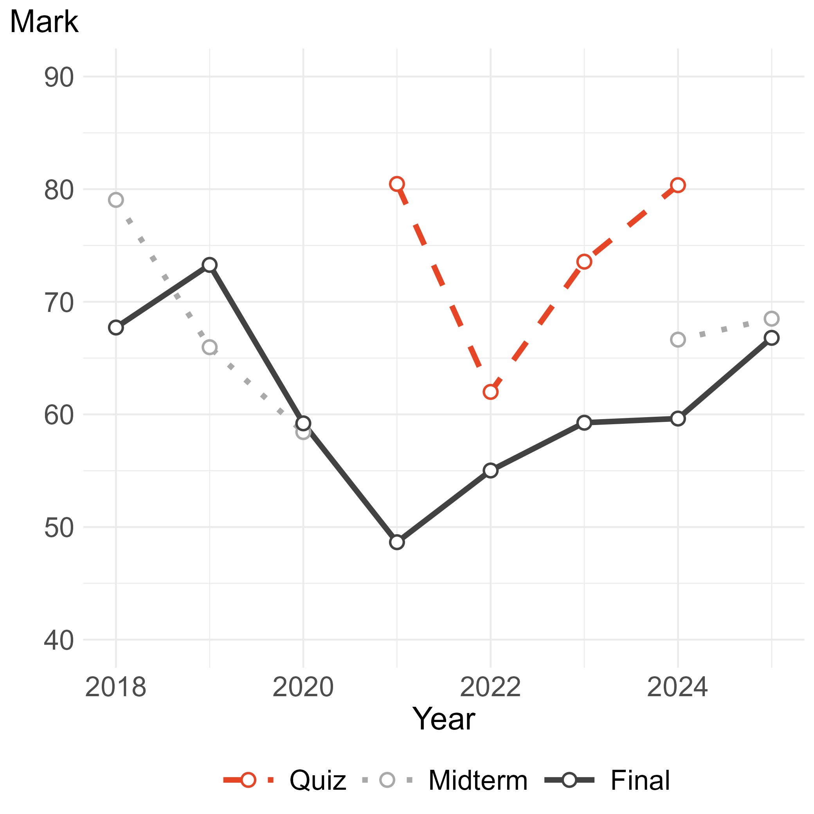
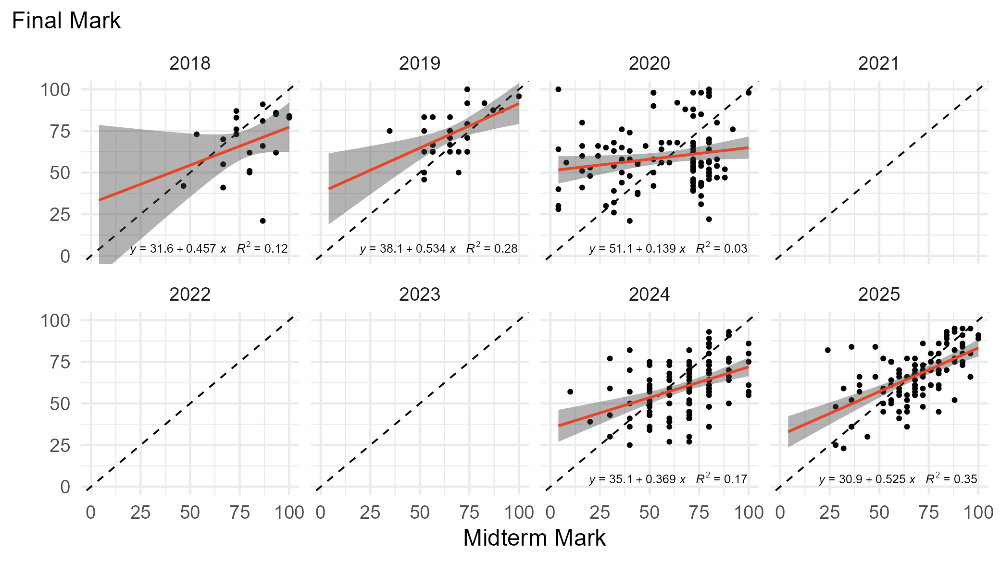
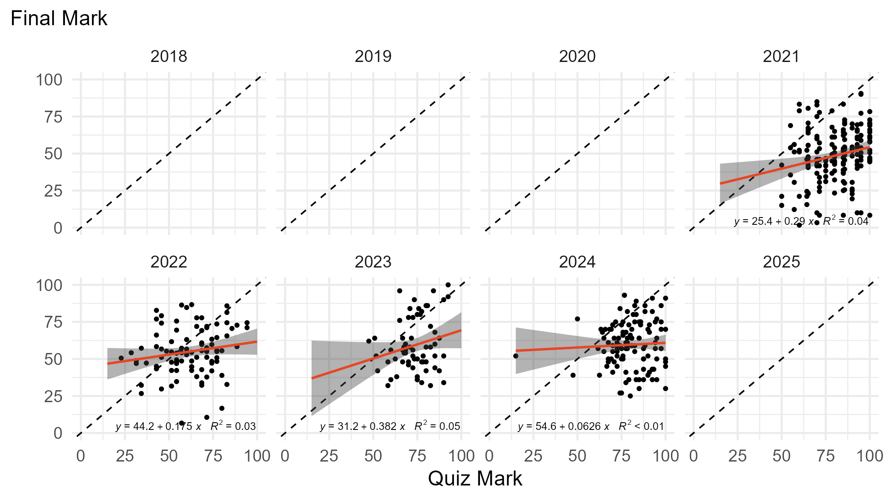
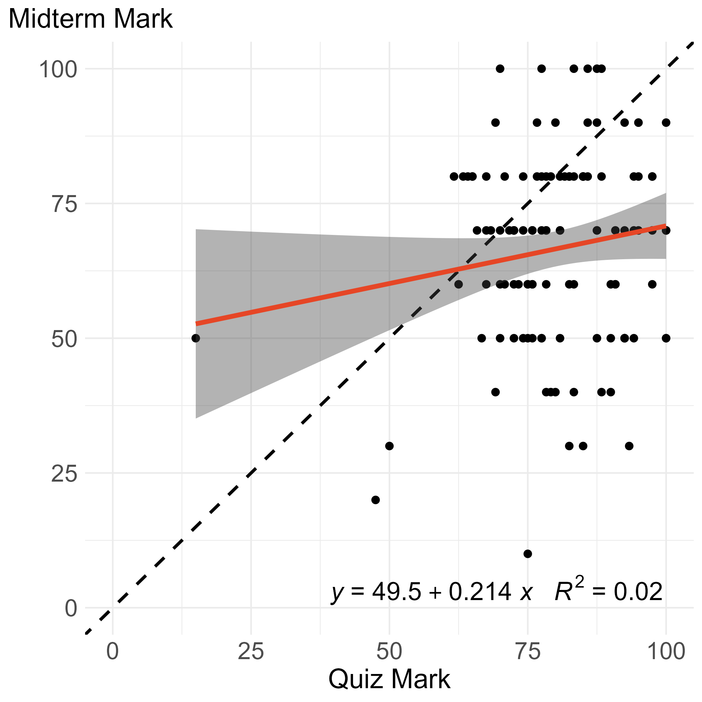
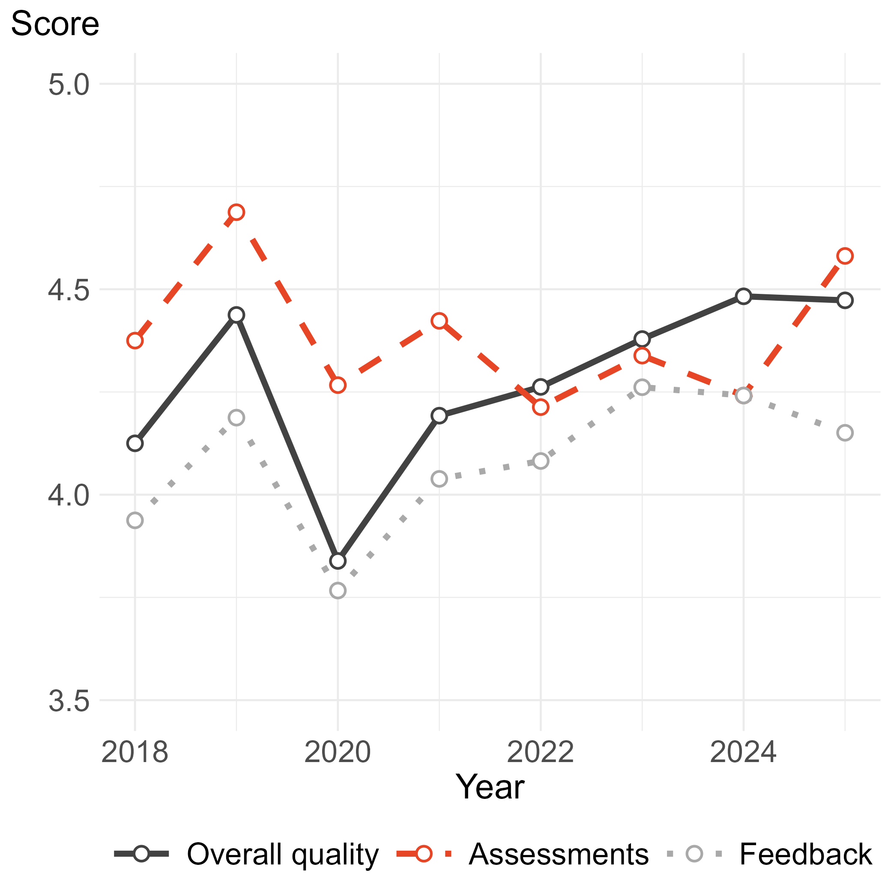
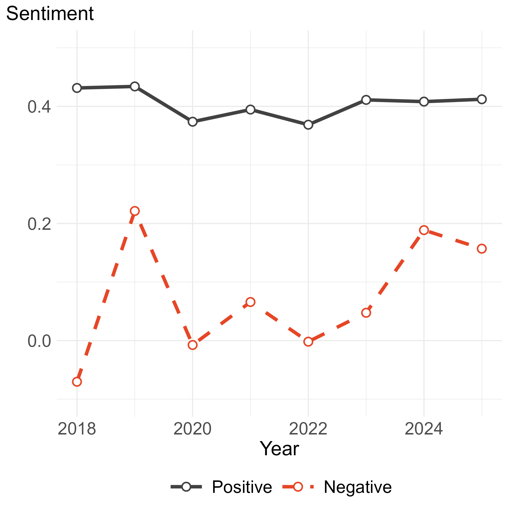

```{r setup, include=FALSE}
knitr::opts_chunk$set(echo = FALSE)
library(extrafont)
loadfonts(device="win",quiet=T)
```


# Why are we having this conversation


.right-85[

Open-book exams have been around for quite some time.

Even open-web exams and assessments are older than most of us would care to admit.

But until recently, they were not a big deal. Certainly not as big of a deal as they are now.

The reason? Technology. Which, as is often the case, can be both a friend and a foe.

]


---


# Some context and relevant details


.right-85[

The following graphs and observations are based on a large(-ish) unit that I have been teaching for over a decade.

The unit is somewhat math-heavy, but not excessively so.

]


---


# Dip and recovery in exam performance


.left-45[

(Closed-book) final exam marks dipped at the onset of the pandemic - following the switch to online teaching - and gradually recovered in subsequent years.

(Open-web) quiz marks were consistently and substantially higher than the final exam marks.

]


.right-45[



]


---


# Midterm marks more or less "explain" final marks


.right-85[



]


---


# Quiz marks are all but unrelated to final marks


.right-85[



]


---


# Hardly any relationship between online and in-class tests


.left-45[

In 2024, I ran both closed-book midterm tests and online quizzes.

For the midterm, I ran three different in-class tests. The midterm mark was based on the best of the three results.

Even so, the average midterm mark was well below the average quiz mark, and quiz performance had virtually no predictive power for the midterm.

]


.right-45[



]


---


# How students score the unit


.left-45[

Student satisfaction - across all dimensions - dipped at the onset of the pandemic, following the switch to online teaching.

Satisfaction with overall quality and feedback recovered quickly, whereas satisfaction with assessment quality remained subdued for as long as (open-web) quizzes constituted a substantial component of assessment.

]


.right-45[



]


---


# What students say about the unit


.left-45[

During the period of pandemic-related online teaching and assessment, there was a **small decline** in the positive sentiment in students’ responses to the open-ended question, “*What have been the best aspects of this unit of study?*”, and a **substantial increase** in the negative sentiment in their responses to the question, “*What aspects of this unit of study most need improvement?*”


]


.right-45[



]


---


# In conclusion...


.right-85[

... and to paraphrase Winston Churchill:

*closed-book exams are the worst form of assessments except for all those other forms that have been tried from time to time.*

]


