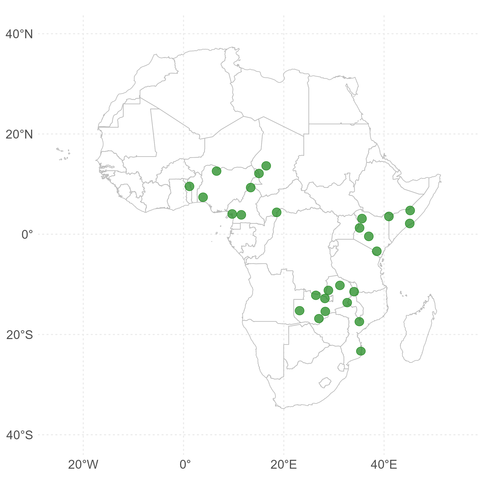
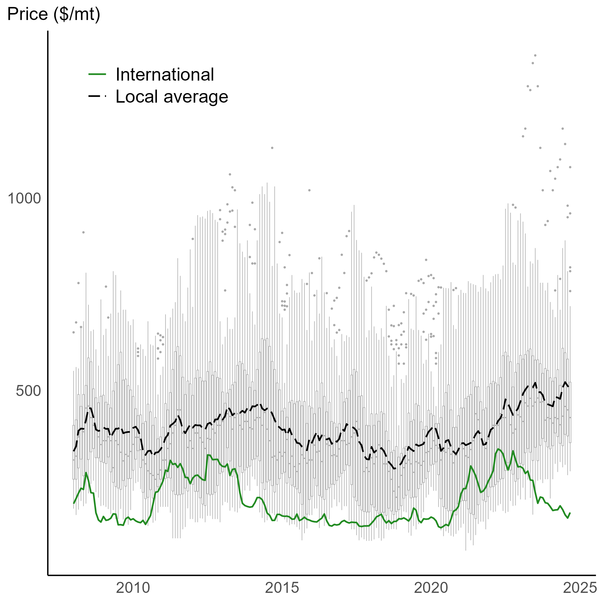
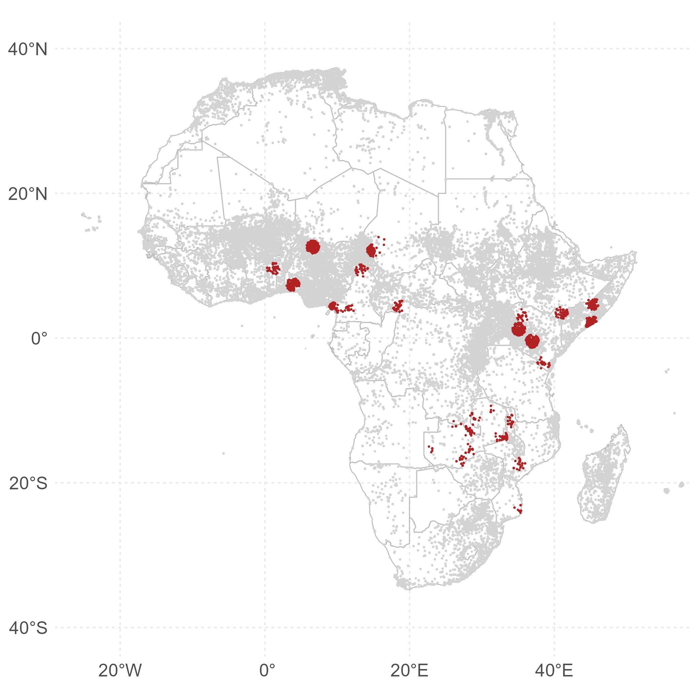
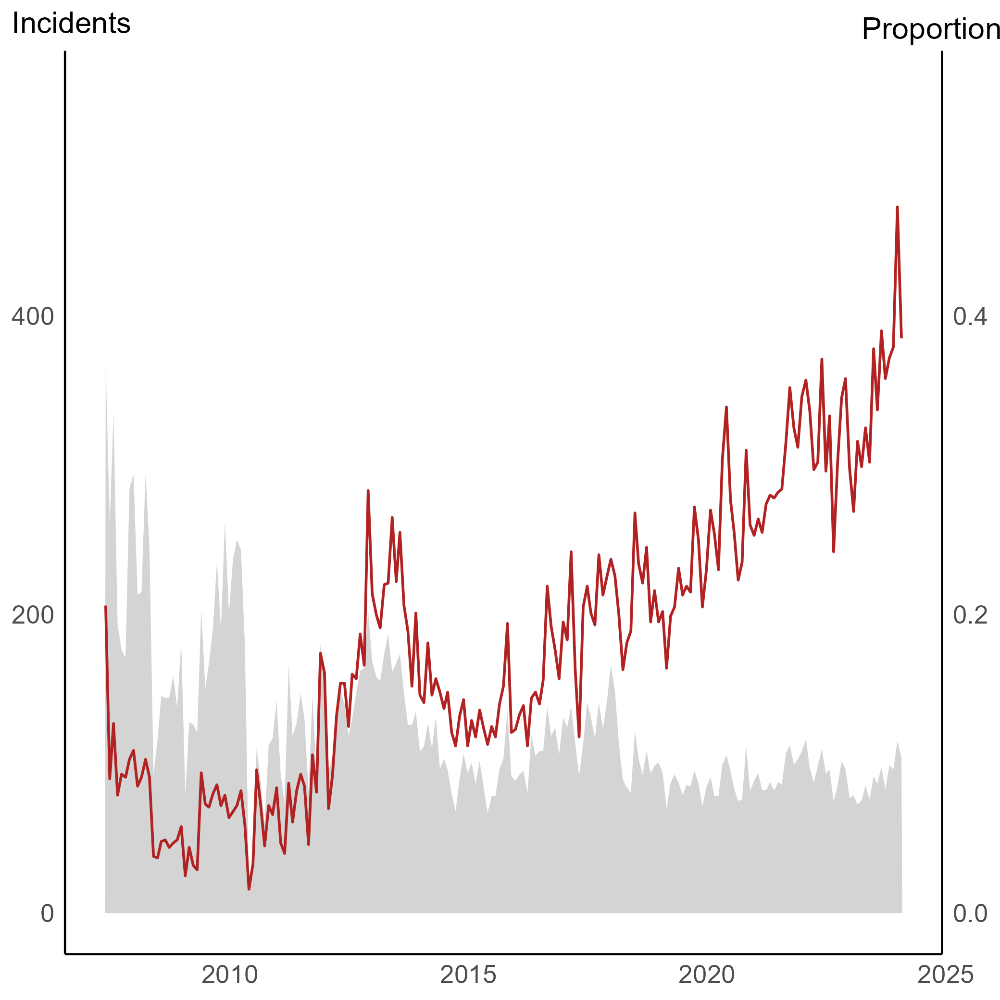

```{r setup, include=FALSE}
knitr::opts_chunk$set(echo = FALSE)
library(extrafont)
loadfonts(device="win",quiet=T)
```


# Commodity price shocks can cause conflict

.right-85[

Commodity price shocks have welfare implications for both net producers and consumers. In economies with dire social conditions and fragile political systems, these shocks may contribute to conflict.

Empirical evidence on the relationship between commodity prices and conflict, particularly in the agricultural sector, is unequivocal ([Blair et al. 2021](https://www.cambridge.org/core/journals/american-political-science-review/article/abs/do-commodity-price-shocks-cause-armed-conflict-a-metaanalysis-of-natural-experiments/469E8F1CBA02E4E5D525E3355DC401D9)). Studies have found both negative relationship ([Dube and Vargas, 2013](https://doi.org/10.1093/restud/rdt009); [Berman and Couttenier, 2015](https://doi.org/10.1162/REST_a_00521);[Fjelde, 2015](https://doi.org/10.1016/j.worlddev.2014.10.032)) and positive relationship ([Crost and Felter, 2020](https://doi.org/10.1093/jeea/jvz025); [McGuirk and Burke](https://doi.org/10.1086/709993); [Ubilava et al., 2023](https://doi.org/10.1111/ajae.12364)) between commodity prices and conflict.

]

---


# Instrumental variable appoach

.right-85[

Most existing studies use international prices as exogenous proxies for local economic shocks ([Berman and Couttenier, 2015](https://doi.org/10.1162/REST_a_00521); [McGuirk and Burke](https://doi.org/10.1086/709993); [Ubilava et al., 2023](https://doi.org/10.1111/ajae.12364)). 

Here, we examine the implied causal mechanism in this relationship by investigating the effect of local prices on conflict, using global prices as an instrumental variable for local prices. 

This two-stage estimation framework allows us to estimate the local average treatment effect of prices on conflict, assuming that local prices are the only channel through which global prices affect local conflict.


]

---


# Markets and prices (FEWS, GIEWS, IMF)


.left-45[



]

.right-45[



]


---


# Conflict (ACLED)


.left-45[



]

.right-45[



]


---


# Baseline specification


$$
\begin{aligned}
CONFLICT_{mt} &= \beta \hat{\log PRICE}_{mt} + FE+\varepsilon_{mt} \\
\log PRICE_{mt} &= \alpha \log PRICE_{t}+FE+\upsilon_{mt}
\end{aligned}
$$


---


# Baseline estimates


| Variable          | Conflict | Battles  | Violence | Protests  |
|:----------------- | --------:| --------:| --------:| ---------:|
| price             | -0.120   |  0.125   |  0.140   | -0.231    | 

---


# Rural-urban


| Variable             | Conflict | Battles  | Violence | Protests  |
|:-------------------- | --------:| --------:| --------:| ---------:|
| price × no capital   | -0.145   |  0.171*  |  0.039   | -0.174  | 
| price × capital      | -0.019   | -0.061   |  0.543   | -0.453*   | 

---


# Croplands


| Variable          | Conflict | Battles  | Violence | Protests  |
|:----------------- | --------:| --------:| --------:| ---------:|
| price             |  0.099   |  0.032   |  0.372   | -0.308*   | 
| price × cropland  | -0.532** |  0.224   | -0.563** |  0.188    | 

---


# Croplands (reduced-form)


| Variable          | Conflict | Battles  | Violence | Protests  |
|:----------------- | --------:| --------:| --------:| ---------:|
| price             |  0.019   |  0.002   |  0.059   | -0.052*   | 
| price × cropland  | -0.127** |  0.065*  | -0.093** |  0.023    | 

---


# Contribution

.right-85[

We contribute to the literature on the economic roots of conflict ([Bazzi and Blattman, 2014](https://www.aeaweb.org/articles?id=10.1257/mac.6.4.1);[McGuirk and Burke, 2020](https://doi.org/10.1086/709993)), with a specific focus on local commodity price shocks.

]


