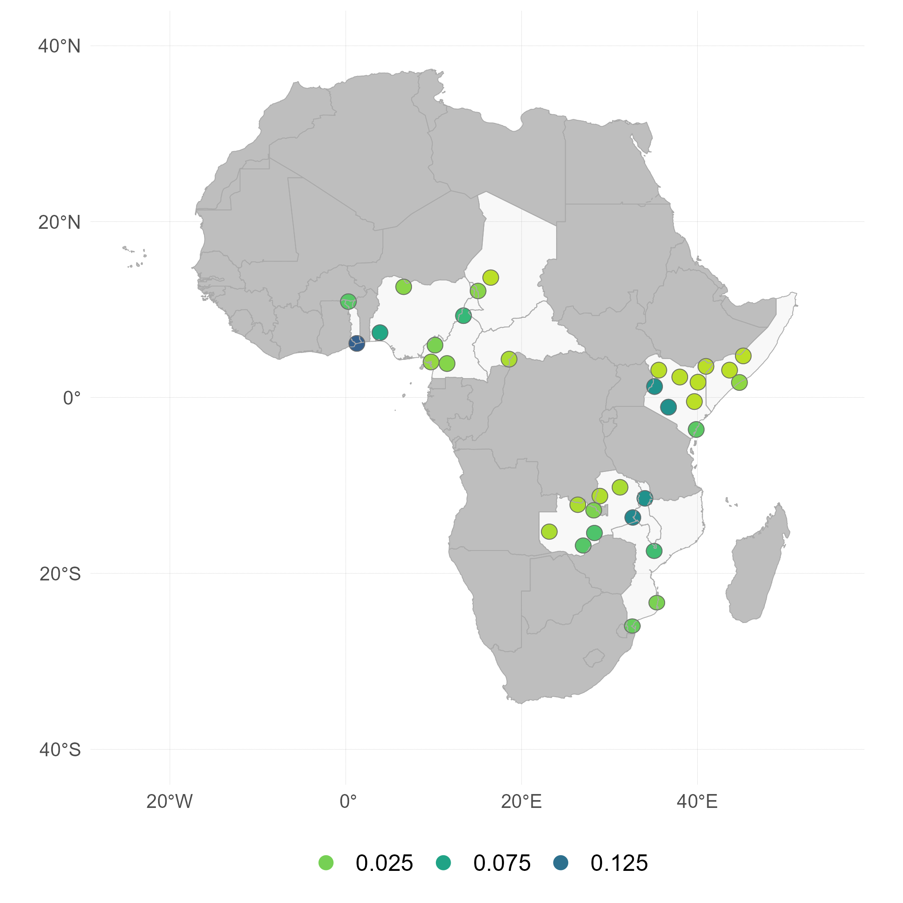
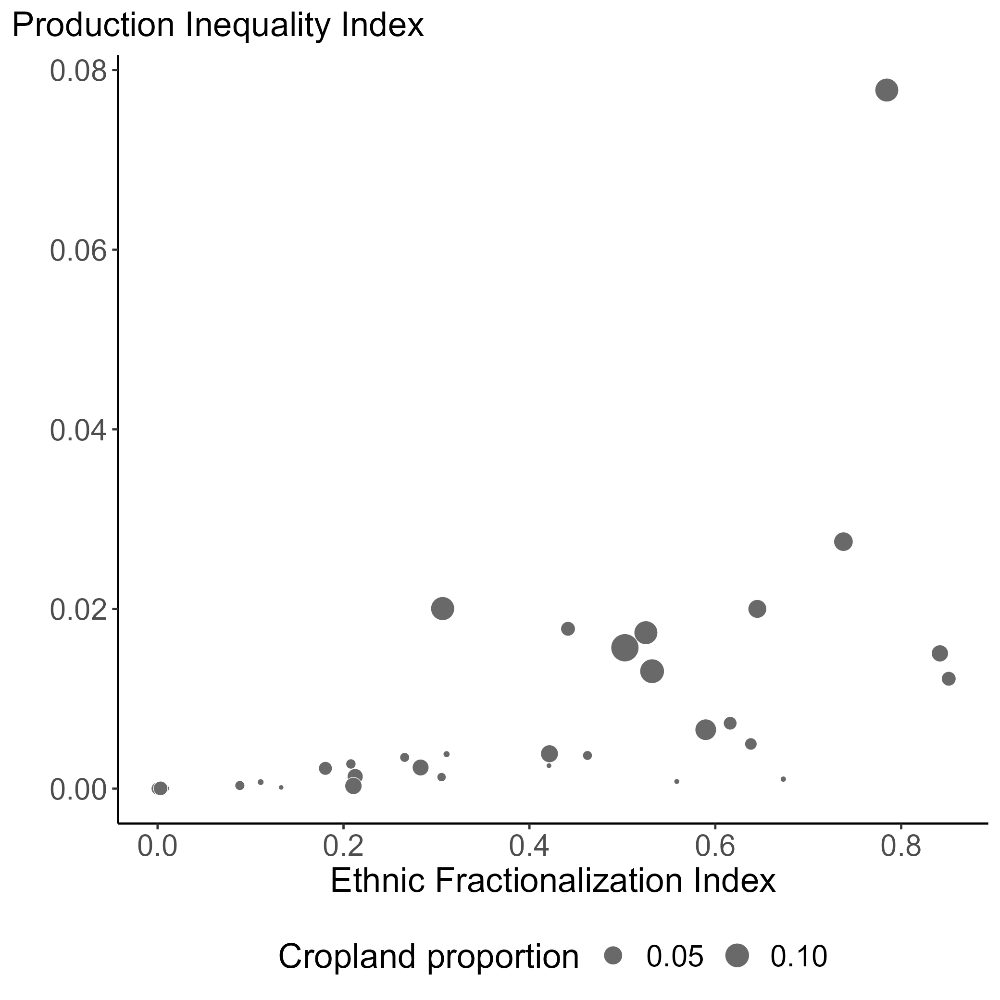

```{r setup, include=FALSE}
knitr::opts_chunk$set(echo = FALSE)
library(extrafont)
loadfonts(device="win",quiet=T)
```


# Commodity prices and conflict

.right-85[

Commodity price shocks have welfare implications for both net producers and consumers. In economies where social conditions are dire and political systems are fragile, these shocks may lead to conflict.

Empirical evidence on the relationship between commodity prices and conflict—particularly in the agricultural sector—is unequivocal ([Blair et al. 2021](https://www.cambridge.org/core/journals/american-political-science-review/article/abs/do-commodity-price-shocks-cause-armed-conflict-a-metaanalysis-of-natural-experiments/469E8F1CBA02E4E5D525E3355DC401D9)). Studies have found both negative ([Dube and Vargas, 2013](https://doi.org/10.1093/restud/rdt009); [Berman and Couttenier, 2015](https://doi.org/10.1162/REST_a_00521);[Fjelde, 2015](https://doi.org/10.1016/j.worlddev.2014.10.032)) and positive ([Crost and Felter, 2020](https://doi.org/10.1093/jeea/jvz025); [McGuirk and Burke](https://doi.org/10.1086/709993); [Ubilava et al., 2023](https://doi.org/10.1111/ajae.12364)) relationships between commodity prices and conflict.

]

---


# We focus on local price shocks

.right-85[

Most studies use international prices as exogenous proxies for local economic shocks ([Berman and Couttenier, 2015](https://doi.org/10.1162/REST_a_00521); [McGuirk and Burke](https://doi.org/10.1086/709993)). 

We examine implied causal mechanism in this relationship by investigating the effect of **local prices** on conflict, using global prices as an instrumental variable for local prices. 

This two-stage estimation framework allows us to estimate the local average treatment effect of prices on conflict, assuming that local prices are the sole channel through which global prices affect local conflict.


]

---


# We focus on concrete markets

.right-85[

Most studies perform country- ([Bazzi and Blattman, 2014](https://www.aeaweb.org/articles?id=10.1257/mac.6.4.1)) or district- or cell-level analysis ([Dube and Vargas, 2013](https://academic.oup.com/restud/article-abstract/80/4/1384/1579342); [McGuirk and Burke](https://doi.org/10.1086/709993)). 

We use a set of specific **markets (cities)** across Africa. This allows us to more accurately measure the effects and responses to income shocks from those who live in or near those cities.


]

---


# We focus on concrete conflict

.right-85[

Most studies use a broad definition of conflict ([Bazzi and Blattman, 2014](https://www.aeaweb.org/articles?id=10.1257/mac.6.4.1); [Berman and Couttenier, 2015](https://doi.org/10.1162/REST_a_00521); [De Winne and Peersman, 2021](https://doi.org/10.1080/07350015.2019.1684301)). 

We focus on a specific type of conflict—**social unrest**—and further disentangle it into protests (a less violent form of conflict) and riots (which, by definition, can be violent insofar as they may qualify as 'political violence' rather than a 'demonstration').


]

---


# We focus on short-term effects

.right-85[

Most existing studies use annual data ([Bazzi and Blattman, 2014](https://www.aeaweb.org/articles?id=10.1257/mac.6.4.1); [Berman and Couttenier, 2015](https://doi.org/10.1162/REST_a_00521); [McGuirk and Burke](https://doi.org/10.1086/709993)). 

We use **monthly data**. This allows us to capture short-term/immediate effects of income shocks rather than long-term/delayed ones, and also helps us make the case for the validity of the instrument. 

]

---


# Markets and prices (FEWS, GIEWS, IMF)


.right-85[

Local prices are incomplete. To subset the useful data for the analysis:

1. we retained locally procured retail prices, reported in USD per kg and originated from a single data source.

2. we excluded series that spanned less than 15 years, had more than 10% missing observations, or contained gaps longer than four consecutive months.

3. we sequentially eliminated markets with overlapping catchment zones—the area within a 100-km radius of a market centroid—with the smallest population count until no overlaps remained.

]

---


# Markets and prices (FEWS, GIEWS, IMF)


.left-50[



]


---


# Markets and prices (FEWS, GIEWS, IMF)


.right-85[


]


---


# Conflict (ACLED)


.left-50[


]


---


# Conflict (ACLED)


.right-85[


]


---


# Baseline specification

.right-85[

$$
\begin{equation}
c_{it}=\beta p_{it} + \mu_i + \tau_i t + \varepsilon_{it}\;~~\text{(second stage)}
\end{equation}
$$


$$
\begin{equation}
p_{it}=\gamma p_{t} + \alpha_i + \delta_i t + \upsilon_{it}\;~~\text{(first stage)}
\end{equation}
$$

where: $c_{it}$ is a binary variable that denotes the incidence of conflict in market $i$ in period $t$; $p_{it}$ is the local price and $p_{t}$ is the global price, both in natural logarithms.

]


---


# No apparent relationship between prices and unrest


.right-85[

| Conflict type        | Unrest     | Protests   | Riots      |
|:-------------------- | ----------:| ----------:| ----------:|
| price                | -0.111     |  0.002     | -0.017     |

]

---


# Agrarian diversity across ethnic boundaries


.left-50[


]


---


# Agrarian diversity across ethnic boundaries


.left-45[


]

.right-45[


]


---


# Agrarian diversity aggrevates social unrest


.right-85[

| Conflict type        | Unrest     | Protests   | Riots      |
|:-------------------- | ----------:| ----------:| ----------:|
| price                |  0.063     |  0.080     | -0.101     |
| price × area         |  0.063     |  0.110     | -0.292     |
| price × frac         | -0.741\**  | -0.518\*   |  0.528     |
| price × ineq         |  0.859\**  |  0.759     | -0.106     |

*area* is the proportion of the area used for maize production.

*frac* $=\sum_i \pi_i(1-\pi_i)$ is index of ethnic fractionalization.

*ineq* $=\sum_i\sum_j \pi_i\pi_j\delta_{ij}$, where $\delta_{ij}=|area_i-area_j|$ is index of maize production inequality.

]

---


# Growing-season rainfall deviation dampens the effect


.right-85[


| Conflict type        | Unrest     | Protests   | Riots      |
|:-------------------- | ----------:| ----------:| ----------:|
| price                |  0.082     |  0.097     | -0.983     |
| price × area         |  0.103     |  0.147     | -0.260     |
| price × frac         | -0.817\**  | -0.592\*   |  0.469     |
| price × ineq         |  0.905\*** |  0.836\**  | -0.086     |
| price × rain         | -0.041\**  | -0.038     | -0.030     |
| price × area × rain  |  0.209\*** |  0.210\**  |  0.161\*** |
| price × frac × rain  |  0.145\**  |  0.178\*   |  0.010     |
| price × ineq × rain  | -0.447     | -0.537     | -0.202     |

]

---


# Contributions

.right-85[

We contribute to the literatures on 

- the economic origins of conflict ([Bazzi and Blattman, 2014](https://www.aeaweb.org/articles?id=10.1257/mac.6.4.1); [McGuirk and Burke, 2020](https://doi.org/10.1086/709993)).

- the agro-climatic roots of conflict ([Hendrix and Salehyan, 2012](https://doi.org/10.1177/0022343311426165); [Ubilava, 2025](https://doi.org/10.1111/ajae.12504)).

- the ethnic diversity and conflict ([Alesina et al., 2011](https://doi.org/10.1111/j.1542-4774.2010.01009.x); [Bazzi and Gudgeon, 2021](https://www.aeaweb.org/articles?id=10.1257/app.20190309)).

]


---


# Identification

.right-85[

Identification relies on assumptions of (i) exogeneity: global price shocks are exogenous to local price shocks and conflict; (ii) relevance: global price shocks are transmitted to local prices; and (iii) exclusion: global shocks affect conflict only through their impact on local prices.

]

---


# Identification: (i) Exogeneity

.right-85[

The assumption that global maize prices are exogenous to local conflict and prices in Africa is both plausible and widely accepted given that the continent accounts for only a small share of global maize production. For instance, Nigeria—the largest maize producer in our sample and second in the region after South Africa—contributes less than one percent of global maize output [FAO, 2025](https://www.fao.org/faostat/en/#data/QCL).

]

---


# Identification: (ii) Relevance

.right-85[

Empirical evidence suggests that global price shocks are transmitted—albeit imperfectly—to local markets, with an average transmission elasticity in the 0.3–0.4 range ([Baquedano and Liefert, 2014](https://doi.org/10.1016/j.foodpol.2013.11.001); [Dillon and Barrett, 2015](https://doi.org/10.1093/ajae/aav040)). Country-specific elasticities vary widely, from near zero (e.g., Burkina Faso, Niger, and Zambia) to well above 0.5 (e.g., Malawi and Ethiopia).

]

---


# Identification: (iii) Exclusion

.right-85[

This is the most tenuous of the three assumptions, as global commodity price shocks could influence local conflict through channels other than local prices. 

Our empirical framework—which relies on monthly data and focuses on specific, smaller-scale types of conflict as opposed to large-scale events—allows us to reasonably argue that local prices are the only plausible channel through which international price shocks could affect conflict.

]

---


# Agrarian diversity across ethnic boundaries


.left-45[


]

.right-45[



]


