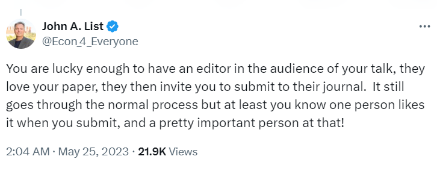
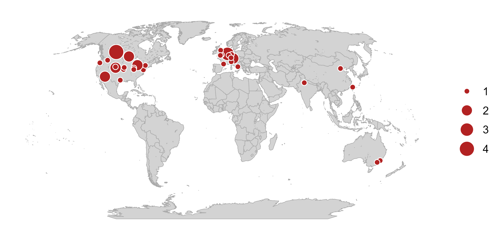
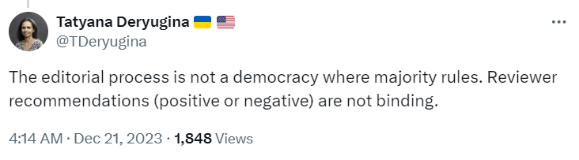

```{r setup, include=FALSE}
knitr::opts_chunk$set(echo = FALSE)
library(extrafont)
loadfonts(device="win",quiet=T)
```


# Agricultural economics as a field of economics (?!)

.right-85[

Agricultural Economics is one of the oldest fields of economics. Agricultural economists have made important contributions to the [discipline of economics](https://doi.org/10.1002/aepp.13453) and to the [economy](https://doi.org/10.1002/aepp.13454). 

Agricultural Economics is not part of the National Bureau of Economic Research (NBER)&mdash;an elite and arguably the most powerful club in the discipline of economics.

Clubs (and networks) matter.

]

---


# Clubs and networks in economics reviewing

.right-85[

In January 2022, an [NBER working paper by Carrell and co-authors](https://www.nber.org/papers/w29631) argued that "*clubs and networks play a large role in influencing both editor and reviewer decisions.*"

In September 2024, the [published version of the paper in the Journal of Political Economy](https://doi.org/10.1086/730208) clarified that: "*Authors who attended the same PhD program, worked with, affiliate with the same National Bureau of Economic Research program(s), or are closely linked via coauthorship networks as the handling editor are more likely to avoid a desk rejection.*"

]

---


# Sometimes you just need to be lucky

.right-85[

[](https://x.com/Econ_4_Everyone/status/1661402780815314944)

]

---


# Geographic diversity in economic publishing

.right-85[

In 2020, my co-authors and I collected data on editors from 49 top economics journals (category A* in the ABDC list). The results, which we [published in the Journal of Economic Behavior & Organization](https://doi.org/10.1016/j.jebo.2021.08.005), were expected but striking:

- Over 1/2 the journals have over 2/3 of their editors in the USA.
- Most journals have a tiny editorial contribution from academics located outside of North America and Europe. 
- Any one of the states of California, Massachusetts and Illinois has more editors than Asia, South America, Africa and Australasia combined.

]

---


# Top agricultural economics journals

.right-85[

In their [recent paper](https://doi.org/10.1111/1477-9552.12473), Finger and co-authors rank (fairly reasonably) agricultural economics journals as follows:

<table>
  <thead>
    <tr>
      <th>Rank</th>
      <th>Journal Title</th>
      <th>IF</th>
    </tr>
  </thead>
  <tbody>
    <tr><td>1</td><td>American Journal of Agricultural Economics</td><td>4.2</td></tr>
    <tr><td>2</td><td>Food Policy</td><td>6.8</td></tr>
    <tr><td>3</td><td>Journal of Agricultural Economics</td><td>3.4</td></tr>
    <tr><td>4</td><td>Agricultural Economics</td><td>4.5</td></tr>
    <tr><td>5</td><td>European Review of Agricultural Economics</td><td>3.3</td></tr>
    <tr><td>6</td><td>Australian Journal of Agricultural and Resource Economics</td><td>2.6</td></tr>
    <tr><td>7</td><td>Journal of Agricultural and Resource Economics</td><td>1.2</td></tr>
    <tr><td>8</td><td>Applied Economic Perspectives and Policy</td><td>3.3</td></tr>
    <tr><td>9</td><td>Canadian Journal of Agricultural Economics</td><td>2.5</td></tr>
    <tr><td>10</td><td>Agribusiness</td><td>2.1</td></tr>
  </tbody>
</table>

]

---


# Editors of top agricultural economics journals

.right-85[



]

---


# If the mountain won't come to Muhammad...

.right-85[

If you are an academic in the USA/Canada or EU/UK, there is a good chance that an editor (or a potential reviewer) is in the audience during your seminar talk (for example). 

If you are an "outsider," you can achieve a comparable (though not similar) result by presenting at a conference attended by one of those editors.

]


---


# Making it work... as a reviewer

.right-85[

People view reviewing as a service. But it is more than that.

It is a way for an author to pay it forward&mdash;if you have published or plan on publishing in a journal, you "owe" them a review or two.

Importantly, it is also a way to "introduce" yourself to an editor. 

Knowing the editor does not guarantee a positive outcome. But empirical evidence suggest that it helps at the margin.

]


---


# Navigating peer review

.right-85[

The peer review process begins when the first draft of the paper is completed and ends when the paper is published in a journal.

In his [excellent book](https://mitpress.mit.edu/9780262543552/doing-economics/), Bellemare has a separate chapter on this. 

In what follows, I will highlight some key elements of the peer review process, including its dos and don'ts. 

]

---


# From first draft to first submission

.right-85[

When the first draft of the paper is ready, circulate it among a small group of peers, preferably senior scholars with expertise in a similar topic. 

Once you incorporate their feedback into the paper, share it more broadly by posting on repositories like [arXiv](https://arxiv.org/) and presenting it at conferences and seminars. 

Use every opportunity to heighten visibility of your work and, in the process, to make any "low-cost" improvements to it.

]

---


# Deciding on the journal

.right-85[

The pool of the journals is not as large as it may seem. There are likely only a handful of journals that will be willing to eventually publish your paper and where you would want it to be published.

As an aside, in the intermediate term, bring the two circles of this Venn diagram closer together&mdash;i.e., write the types of papers that have the best chance of being published in the journals where you want to publish.

These could be very different sets of journals. Under no circumstances should these be predatory journals.

]

---


# First submission

.right-85[

One strategy is to target the highest-ranked journal first and, if unsuccessful, move to the next best journal. After all, you only need to get lucky once. Also, if the paper is peer reviewed, there is a better chance of receiving higher-quality reviewer reports from higher-ranked journals.

Another strategy may be to target the journal that is most likely to accept the paper and, if rejected after the peer review, to address any issues and move to the higher ranked journal.

]

---


# After submitting to a journal

.right-85[

There are three (maybe four) possible outcomes:

1. Desk reject (without sending to reviewers)

2. Reject (with reviewer reports)

3. Revise and resubmit (with reviewer reports)

4. (very rarely) Reject and resubmit (usually with reviewer reports)

]

---


# Desk rejections come in many flavors

.right-85[

Desk rejections are common. Many decision letters, somewhat cynically, state: "We receive many excellent papers and regretfully we have to reject some." Truth is, excellent papers do not get rejected; they certainly do not get desk rejected.

The papers get desk rejected because:

1. they do not align with the scope of the journal
2. they are simply not good
3. they are badly written

]

---


# Getting the journal right

.right-85[

Try to cite several papers from the target journal or, at least, from journals that are in the same field as the target journal. 

This is not just a strategy advice. This is also a "litmus test"&mdash;If you cannot do so, perhaps you are aiming at the wrong journal. 

It is, of course, possible to publish in a journal without having engaged with the literature from the field. But this is quite unlikely, and you would need to compensate the lack of engagement with the quality and novelty of research.

]

---


# Getting the research right

.right-85[

When I desk reject, in my decision letter, I state: 
> *For me to proceed with a peer-review process, a manuscript ...: (i) [...] should provide food policy-relevant contributions with broad appeal; (ii) [...] should be free of obvious technical shortcomings that may limit the impact of work; and (iii) [...] should answer, or show the potential to answer, the "so what?" question.*

The first point is about the scope. The second and third points are about the research quality. 

]

---


# Getting the story right

.right-85[

Perhaps the most annoying reason (both for the authors as well as the editor) for desk rejection is when the authors fail to tell a good story of otherwise good research.

Economists are not known to be good story tellers. Moreover, English&mdash;the go-to language in academic publishing&mdash;is often the second or third language for many authors. 

As an editor, a reviewer, and an author, I cannot overstate the potential benefits of hiring a professional copy-editor to address any linguistic and grammatical issues in the paper.

]

---


# Dealing with desk rejections

.right-85[

One (arguably the most efficient) strategy is to quickly move on to the next journal. 

In general, this is a reasonable strategy. There is a fair bit if idiosyncrasy in desk rejections.

But at some point, especially after a few desk rejections, you should ask yourself: "*Might it be that it's not them it's us?*"

]

---


# Rejections after peer review

.right-85[

As with desk rejections, the editor makes an educated guess about the suitability of the paper to the journal. This time, however, the editor's information set contains reviewers' recommendations as well.

]


---


# Every editor's pet peeve

.right-85[

[](https://x.com/TDeryugina/status/1737521818582319153)

]

---


# There is one gatekeeper and it’s the editor

.right-85[

The system is authoritarian; it is not meant to be democratic (where reviewers cast votes). Reviewers are instrumental in the process, but the editor is the sole decision-maker.

Far too often, I come across comments like: “**I served as a reviewer to some paper and I accepted it**” or “**the reviewer accepted the paper but the editor rejected it.**” There is one person, for better or worse, who accepts or rejects the papers&mdash;and that's the editor.

]


---


# Dealing with rejections after the peer review

.right-85[

As with desk rejections, one option is to move to the next journal. 

Proponents of this strategy argue that the next submission is a fresh start (with a new editor and a new set of reviewers).

This might be true. But it seems unwise to completely disregard potentially valuable feedback from the editor and reviewers.

And there is always a chance you will encounter the same reviewer. Having them as an "ally" can be a smart strategy.

]

---


# How not to deal with rejection

.right-85[

Whether it is a desk rejection or a rejection after peer review, there is always the option to appeal the decision.

But it doesn't mean you should use it.

You may be tempted to appeal if you think the reviewers were positive about your work but the editor rejected the paper. 

First of all, the reviewers may have used "positive" tone in "negative" reports, and, in any case, the editor has their own preferences or ways of interpreting the reviewer reports.

]

---


# Requests to revise and resubmit

.right-85[

People tend to celebrate requests to revise and resubmit (R&R), and for good reason&mdash;such outcomes are relatively rare.

But an R&R is not an acceptance; it does not always lead to one.

An R&R typically means the editor sees a path for publishing your paper in their journal. But it is *your* job to walk that path.

]


---


# Dealing with requests to revise and resubmit

.right-85[

Prioritize it&mdash;the conditional probability of acceptance has, at least, quadrupled.

Take the editor's and reviewers' comments seriously. 

You will probably disagree with some of the comments. A few comments may, indeed, be unreasonable or perhaps even wrong. After all, reviewers, like authors, are only human. But be generous (and polite) in your responses. Give them the benefit of the doubt: could it be that they got it wrong because you failed to explain something clearly?

]

---


# "Done" doesn't always do it

.right-85[

Far too often, I have seen authors respond to lengthy comments with just one word: "*Done.*" 

I generally appreciate brevity and the Hemingway style of writing, but "*Done*" is not always good enough of a response. 

Clarity is the key. If one word can clearly explain the job done, by all means, go for it. 

Otherwise, succinctly explain what changes you made (and how that fixed the issue). 

]

---


# Even Acemoglu has failed

.right-85[

Rejections happen often and to the best in the profession. 

> "**As a junior author, I had a paper at the Review of Economic Studies that went to four rounds of revision in almost four years and then a new editor came in and rejected it right away. [...], I felt like everything was going to collapse.**" ~ Daron Acemoglu in *The Art and Practice of Economics Research* by Simon Bowmaker.

But rejected papers do not make the CV, the accepted ones do.

]

---


# In conclusion

.right-85[

Academic publishing is difficult, but you probably wouldn't want it any other way.

Set your aspirations high but keep your expectations low.

Every paper you write will likely be the best you have written up to that point, and the worst you will write from that point forward. Keep progressing.

To quote one of my professors: "Do the right things, and good things will happen to you."

]

---


# Acknowledgement and disclaimers

.right-85[

This presentation has benefited from interactions and direct feedback from [Marc Bellemare](https://apec.umn.edu/people/marc-bellemare), [Chris Barrett](https://economics.cornell.edu/chris-barrett), and [Tim Richards](https://search.asu.edu/profile/92424).

The views expressed here are mine and should not be attributed to the institutions I am employed by or associated with, nor to the publishers I am affiliated with through my editorial roles.

The advice I give is in good faith. I cannot be held responsible for any setbacks related to it. The system is highly heterogeneous as well as idiosyncratic, and experiences vary.

]
