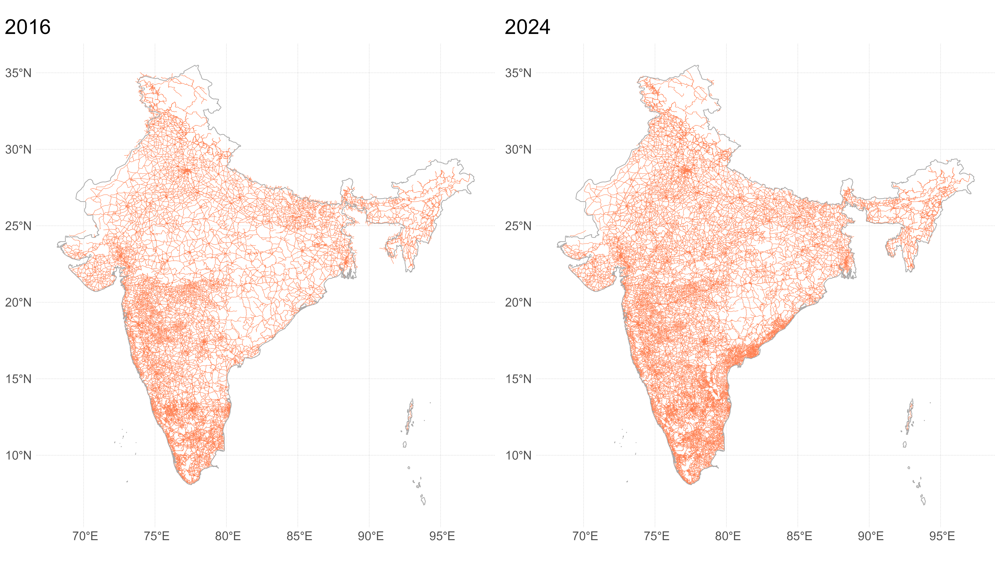
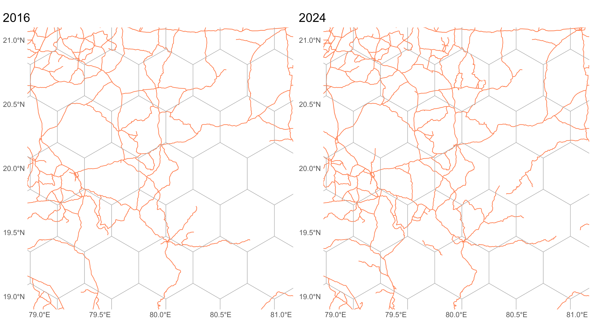
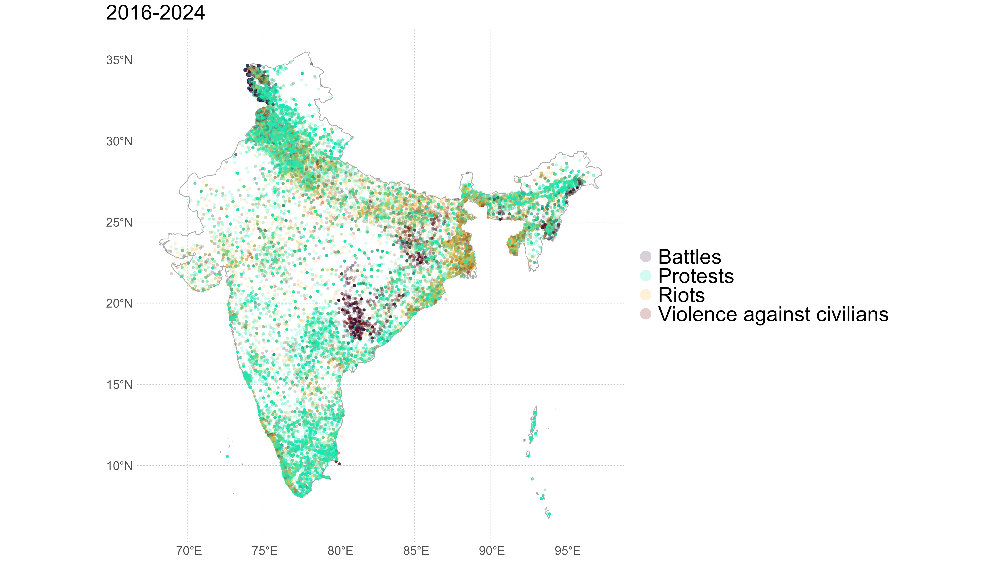
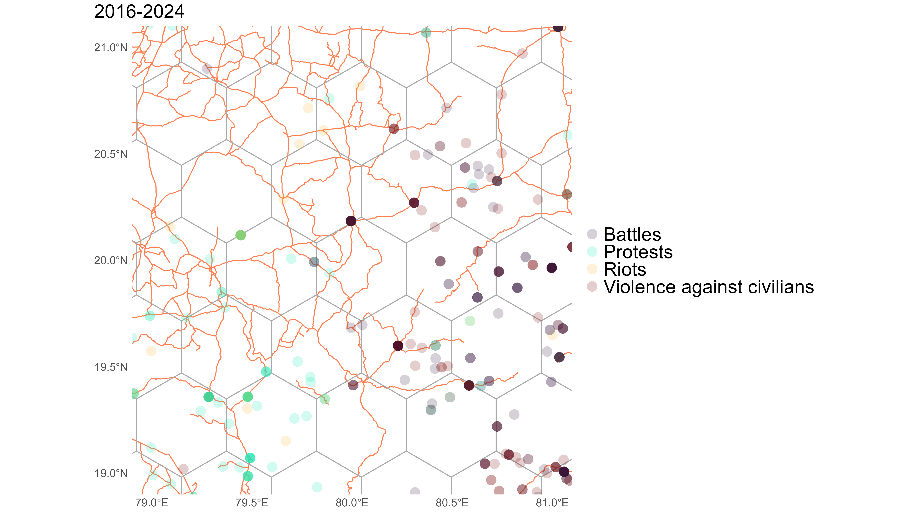
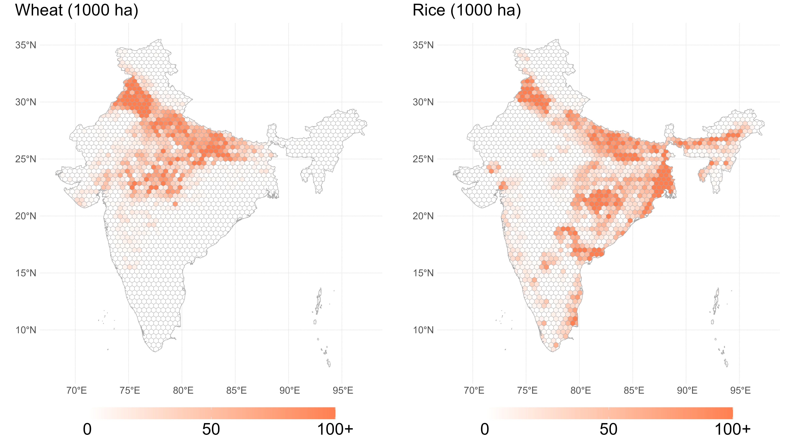
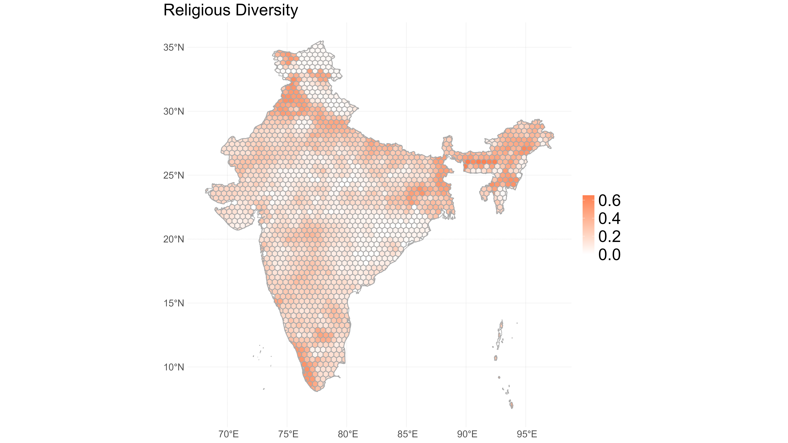

```{r setup, include=FALSE}
knitr::opts_chunk$set(echo = FALSE)
library(extrafont)
loadfonts(device="win",quiet=T)
```


# Roads are good... but they may also lead to bad outcomes

.right-85[

Roads facilitate economic growth by providing access to markets ([Donaldson, 2018](https://www.aeaweb.org/articles?id=10.1257/aer.20101199)), leading to more competitive pricing of goods and services and creating employment opportunities ([Aggarwal, 2018](https://doi.org/10.1016/j.jdeveco.2018.01.004); [Asher and Novosad, 2020](https://www.aeaweb.org/articles?id=10.1257/aer.20180268); [Jedwab and Storeygard, 2022](https://doi.org/10.1093/jeea/jvab027)).

But even benevolent interventions, such as rural road construction, can yield unintended negative consequences. In India, for example, new road construction led to increased agricultural fires and particulate emissions with adverse health implications in the village ([Garg et al., 2024](https://www.aeaweb.org/articles?id=10.1257/pol.20220422)).

]

---


# Roads may exacerbate conflict

.right-85[

1. By connecting urban and rural regions, roads (i) provide access to commodity markets and off-farm employment opportunities in cities, and (ii) enable recruitment of protesters from villages. This may alleviate grievances and resentment in villages, but increase tensions and the risk of social unrest in cities ([Bohlken and Sergenti, 2010](https://journals.sagepub.com/doi/full/10.1177/0022343310373032); [Wischnath and Buhaug, 2014](https://link.springer.com/article/10.1007/s10584-013-1004-0)).
2. By connecting regions with different ethnic or religious backgrounds, roads increase the diversity of people comprising the integrated region. This may lead to more civil violence in the region ([Mitra and Ray, 2014](https://www.journals.uchicago.edu/doi/abs/10.1086/676316); [Bazzi and Gudgeon, 2021](https://www.aeaweb.org/articles?id=10.1257/app.20190309); [Panza and Swee, 2023](https://doi.org/10.1016/j.jebo.2022.11.032)). 

]

---

# Roads network across India

.right-85[



]

---


# Roads network across grid cells

.right-85[



]

---


# Conflict across India

.right-85[



]

---


# Conflict across grid cells

.right-85[



]

---


# Baseline specification


$$
\begin{aligned}
\mathbb{1}\left(CONFLICT_{it}\right)   &= \beta \log ROADS_{it} \\
                &+ \mu_i+\lambda_{t}+\theta'X_{it}+\varepsilon_{it}
\end{aligned}
$$


---


# Baseline estimates


| Variable          | Conflict | Protests  | Riots    | Violence | Battles  |
|:----------------- | --------:| ---------:| --------:| --------:| --------:|
| roads             | -0.0010  | -0.0017   | -0.0001  | -0.0001  | 0.0002   |

---


# Croplands

.right-85[



]

---


# Croplands specification

$$
\begin{aligned}
\mathbb{1}\left(CONFLICT_{it}\right)   &= \beta_1 \log ROADS_{it} \\
                &+ \beta_2 \log ROADS_{it}\times CROPLAND_{i} \\ 
                &+ \mu_i+\lambda_{t}+\theta'X_{it}+\varepsilon_{it}
\end{aligned}
$$


---


# Croplands estimates (wheat and rice)


| Variable         | Conflict | Protests  | Riots    | Violence | Battles  |
|:---------------- | --------:| ---------:| --------:| --------:| --------:|
| roads            | -0.0060*** | -0.0063*** | -0.0013** | 0.0000    | 0.0002    |
| roads × cropland | 0.0005**   | 0.0005**   | 0.0001**  | -0.0000   | -0.0000   |


---


# Croplands estimates (wheat only)


| Variable         | Conflict | Protests  | Riots    | Violence | Battles  |
|:---------------- | --------:| ---------:| --------:| --------:| --------:|
| roads            | -0.0021  | -0.0027** | -0.0004  | 0.0001    | 0.0002    |
| roads × cropland | 0.0002   | 0.0002    | 0.0001   | -0.0000   | -0.0000   |


---


# Crop prices specification

$$
\begin{aligned}
\mathbb{1}\left(CONFLICT_{it}\right)   &= \beta_1 \log ROADS_{it} \\
                &+ \beta_2 \log ROADS_{it}\times CROPLAND_{i} \\ 
                &= \beta_3 \log ROADS_{it}\times \log PRICE_{t} \\
                &+ \beta_4 \log ROADS_{it}\times CROPLAND_{i}\times \log PRICE_{t} \\ 
                &+ \mu_i+\lambda_{t}+\theta'X_{it}+\varepsilon_{it}
\end{aligned}
$$


---


# Crop prices estimates


| Variable         | Conflict | Protests  | Riots    | Violence | Battles  |
|:---------------- | --------:| ---------:| --------:| --------:| --------:|
| roads | -0.0500*** | -0.0530*** | -0.0018  | -0.0008    | 0.0046***  |
| roads × cropland | 0.0002     | 0.0002     | 0.0001   | 0.0001***  | 0.0000**   |
| roads × price | 0.0090***  | 0.0095***  | 0.0002   | 0.0001     | -0.0009*** |
| roads × cropland × price | 0.0000     | 0.0000     | -0.0000  | -0.0000*** | -0.0000**  |

]

---


# Religious diversity

.right-85[



]

---


# Religious diversity specification

$$
\begin{aligned}
\mathbb{1}\left(CONFLICT_{it}\right)   &= \beta_1 \log ROADS_{it} \\
                &+ \beta_2 \log ROADS_{it}\times DIVERSITY_{i} \\ 
                &+ \mu_i+\lambda_{t}+\theta'X_{it}+\varepsilon_{it}
\end{aligned}
$$


---


# Religious diversity estimates

| Variable          | Conflict | Protests  | Riots    | Violence | Battles  |
|:----------------- | --------:| ---------:| --------:| --------:| --------:|
| roads             | -0.0019  | -0.0040** | 0.0010   | 0.0005    | 0.0017**  |
| roads × diversity | 0.0053   | 0.0132    | -0.0061  | -0.0039   | -0.0087** |


---


# Religious diversity and crop prices specification

$$
\begin{aligned}
\mathbb{1}\left(CONFLICT_{it}\right)   &= \beta_1 \log ROADS_{it} \\
                &+ \beta_2 \log ROADS_{it}\times DIVERSITY_{i} \\ 
                &= \beta_3 \log ROADS_{it}\times \log PRICE_{t} \\
                &+ \beta_4 \log ROADS_{it}\times DIVERSITY_{i}\times \log PRICE_{t} \\ 
                &+ \mu_i+\lambda_{t}+\theta'X_{it}+\varepsilon_{it}
\end{aligned}
$$


---


# Religious diversity and crop prices estimates


| Variable         | Conflict | Protests  | Riots    | Violence | Battles  |
|:---------------- | --------:| ---------:| --------:| --------:| --------:|
| roads | -0.0595*** | -0.0608*** | -0.0128*** | -0.0037**  | 0.0057***  |
| roads × diversity | 0.0468**   | 0.0410**   | 0.0562***  | 0.0234***  | -0.0036    |
| roads × price | 0.0106***  | 0.0106***  | 0.0022***  | 0.0006**   | -0.0008*** |
| roads × diversity × price | -0.0070*** | -0.0049*   | -0.0094*** | -0.0041*** | -0.0007    |


]


---

# We contribute to the literature on

.right-85[

1. The unintended consequences of road construction ([Garg et al., 2024](https://www.aeaweb.org/articles?id=10.1257/pol.20220422)), particularly in the context of facilitating an increase in unlawful activities or outcomes ([Agnew, 2020](https://doi.org/10.1111/jors.12491);[Calamunci and Lonsky, 2024](https://doi.org/10.1093/ej/ueae068)). 
2. The economic roots of conflict ([Bazzi and Blattman, 2014](https://www.aeaweb.org/articles?id=10.1257/mac.6.4.1);[McGuirk and Burke, 2020](https://doi.org/10.1086/709993)), with a specific focus on commodity price shocks.

]


